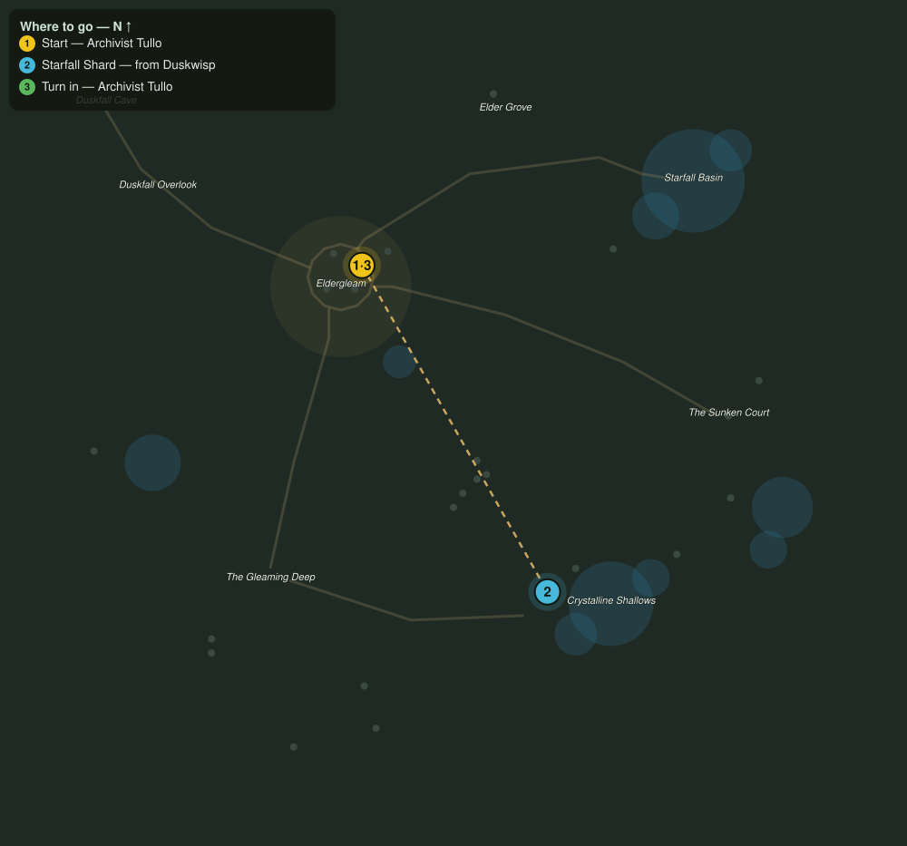

# Shards of Starfall

> Quest ID: `q_shards_of_starfall` · The Veiled Hollow

| | |
|---|---|
| **Recommended level** | 16+ |
| **Quest giver** | **Archivist Tullo**, Reader of Stones _(at ~x:-31, z:1021)_ |
| **Turn in to** | **Archivist Tullo**, Reader of Stones _(at ~x:-31, z:1021)_ |
| **Requires** | What the Stones Remember (`q_monument_tour`) |

## Story

> When the duskwisps pass over the crystal fields, slivers of old starlight cling to them like burrs. Six shards, <your name>, and I can date the sealing to the very season it was sung.

## How to complete

- **Collect 6× Starfall Shard**
  - Drops from [**Duskwisp**](bestiary.md#mob-duskwisp) (50% chance) — Found in the open world at ~x:126, z:1120 (4 mobs, radius 12); Found in the open world at ~x:-30, z:1200 (4 mobs, radius 14)
  - _Tracker: Starfall Shard_

Then return to **Archivist Tullo**, Reader of Stones _(at ~x:-31, z:1021)_ to turn in.

## Rewards

- **XP:** 4000
- **Money:** 1900 copper

## On completion

> Look at the striations! Autumn. The Hollow was sealed in autumn. Two hundred years of argument, settled by six little stones.

## Where to go

**[🧭 Open this route in 3D →](#/questroute/q_shards_of_starfall)**

_Numbered route: ① start → objectives → 3 turn in. Faint dots are the rest of the zone for context — see the [full zone map](README.md). Mob names above link to the [bestiary](bestiary.md)._
