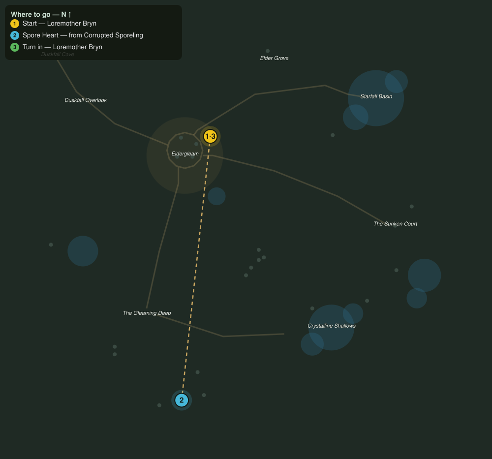

# Hearts of the Ring

> Quest ID: `q_spore_hearts` · The Veiled Hollow

| | |
|---|---|
| **Recommended level** | 16+ |
| **Quest giver** | **Loremother Bryn**, Voice of the Shrine _(at ~x:-20, z:1015)_ |
| **Turn in to** | **Loremother Bryn**, Voice of the Shrine _(at ~x:-20, z:1015)_ |
| **Requires** | Calming the Deep (`q_calming_the_deep`) |

## Story

> When a sporeling falls to the dark, its heart keeps beating with borrowed shadow. Four of those hearts, cleansed at the shrine, may teach us how the corruption spreads. It is grim work, <your name>, but it is mending work.

## How to complete

- **Collect 4× Spore Heart**
  - Drops from [**Corrupted Sporeling**](bestiary.md#mob-corrupted_sporeling) (65% chance) — Found in the open world at ~x:-25, z:1218 (6 mobs, radius 14); Found in the open world at ~x:-60, z:1226 (5 mobs, radius 12)
  - _Tracker: Spore Heart_

Then return to **Loremother Bryn**, Voice of the Shrine _(at ~x:-20, z:1015)_ to turn in.

## Rewards

- **XP:** 4400
- **Money:** 2200 copper

## On completion

> There. Cleansed, and quiet. Each one shows the same mark: the shadow flows FROM the Sunken Court. Tell Saelwyn.

## Leads to

- The Sunken Court (`q_sunken_court`)
- Against the Spore Tide (`q_spore_tide`)

## Where to go

**[🧭 Open this route in 3D →](#/questroute/q_spore_hearts)**

_Numbered route: ① start → objectives → 3 turn in. Faint dots are the rest of the zone for context — see the [full zone map](README.md). Mob names above link to the [bestiary](bestiary.md)._
