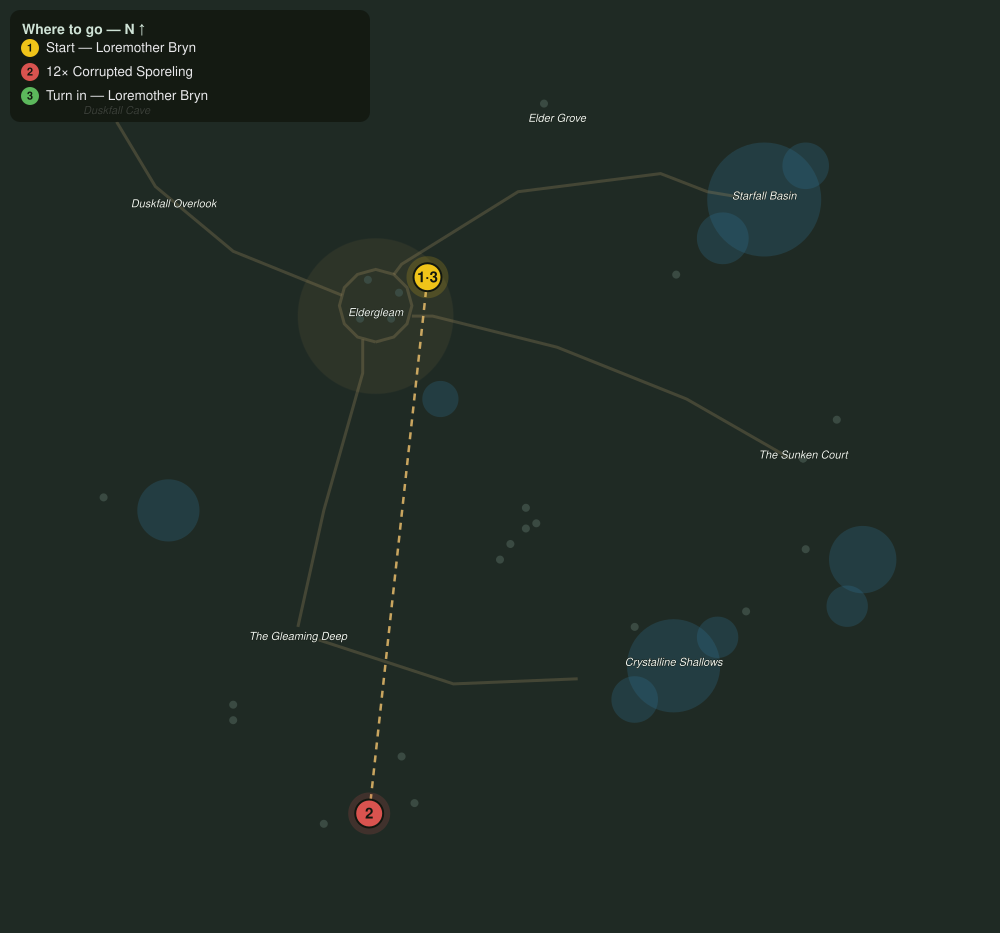

# Against the Spore Tide

> Quest ID: `q_spore_tide` · The Veiled Hollow

| | |
|---|---|
| **Recommended level** | 17+ |
| **Quest giver** | **Loremother Bryn**, Voice of the Shrine _(at ~x:-20, z:1015)_ |
| **Turn in to** | **Loremother Bryn**, Voice of the Shrine _(at ~x:-20, z:1015)_ |
| **Requires** | Hearts of the Ring (`q_spore_hearts`) |

## Story

> The salve holds the Grove, but the corruption presses harder at the Deep with every dusk. Twelve more of the corrupted must be laid to rest before the gatherers can reclaim their north rings, <your name>.

## How to complete

- **Kill 12× [Corrupted Sporeling](bestiary.md#mob-corrupted_sporeling)** (level 16–17)
  - Found in the open world at ~x:-25, z:1218 (6 mobs, radius 14)
  - Found in the open world at ~x:-60, z:1226 (5 mobs, radius 12)
  - _Tracker: Corrupted Sporeling laid to rest_

Then return to **Loremother Bryn**, Voice of the Shrine _(at ~x:-20, z:1015)_ to turn in.

## Rewards

- **XP:** 4400
- **Money:** 2400 copper

## On completion

> The rings in the north are singing again tonight. Quietly, but singing.

## Where to go

**[🧭 Open this route in 3D →](#/questroute/q_spore_tide)**

_Numbered route: ① start → objectives → 3 turn in. Faint dots are the rest of the zone for context — see the [full zone map](README.md). Mob names above link to the [bestiary](bestiary.md)._
