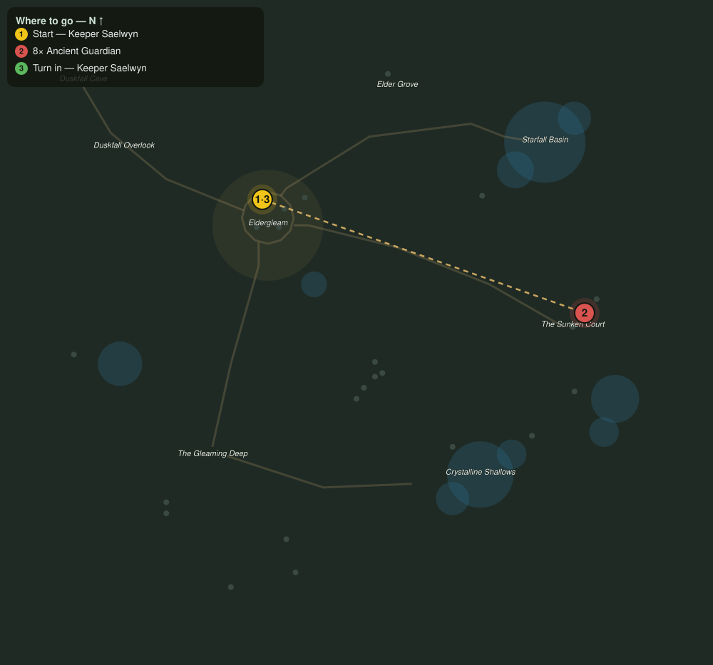

# The Sunken Court

> Quest ID: `q_sunken_court` · The Veiled Hollow

| | |
|---|---|
| **Recommended level** | 17+ |
| **Quest giver** | **Keeper Saelwyn**, Keeper of the Hollow _(at ~x:-43, z:1016)_ |
| **Turn in to** | **Keeper Saelwyn**, Keeper of the Hollow _(at ~x:-43, z:1016)_ |
| **Requires** | Hearts of the Ring (`q_spore_hearts`) |

## Story

> Bryn read the hearts true: the tear runs through the old court in the east, and its guardians have woken wrong. They were built to protect the seal; now they will crush anyone who nears it. Clear eight of them from the ruins.

## How to complete

- **Kill 8× [Ancient Guardian](bestiary.md#mob-ancient_guardian)** (level 18–19, **Elite**)
  - Found in the open world at ~x:125, z:1085 (5 mobs, radius 16)
  - Found in the open world at ~x:138, z:1070 (3 mobs, radius 10)
  - _Tracker: Ancient Guardian stilled_

Then return to **Keeper Saelwyn**, Keeper of the Hollow _(at ~x:-43, z:1016)_ to turn in.

## Rewards

- **XP:** 5200
- **Money:** 2600 copper

## On completion

> Eight guardians, stilled. I remember when they were raised, $N. Do not look so surprised; the Hollow keeps its keepers a long time.

## Leads to

- The Waking Warden (`q_waking_warden`)
- Echoes of the Warden (`q_wardens_echoes`)

## Where to go

**[🧭 Open this route in 3D →](#/questroute/q_sunken_court)**

_Numbered route: ① start → objectives → 3 turn in. Faint dots are the rest of the zone for context — see the [full zone map](README.md). Mob names above link to the [bestiary](bestiary.md)._
