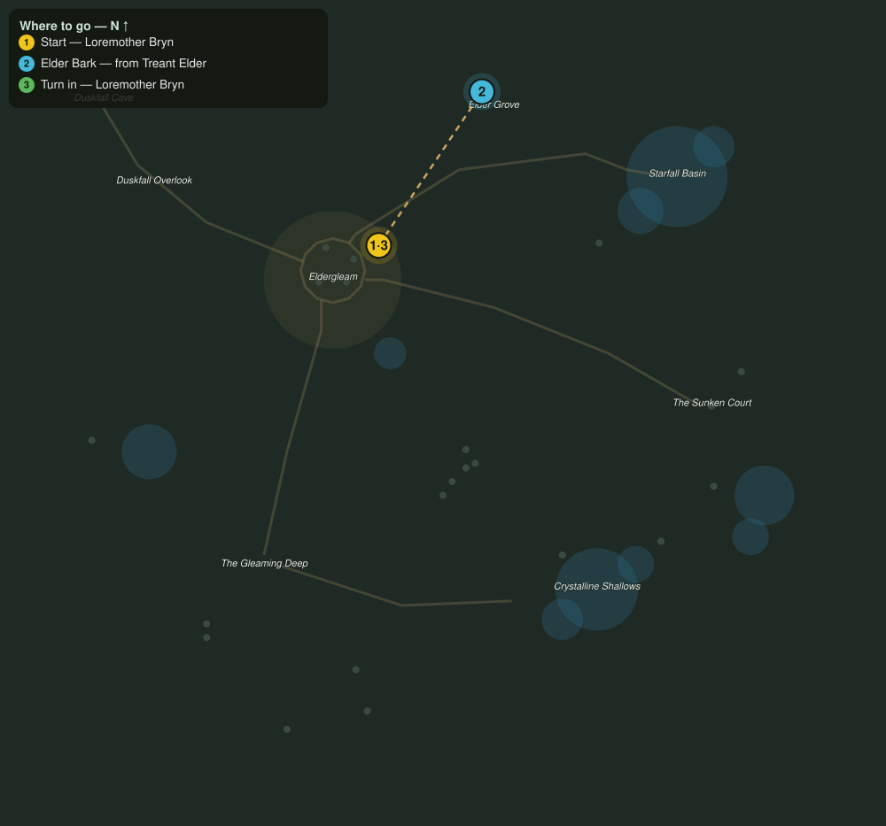

# The Treant Accord

> Quest ID: `q_treant_accord` · The Veiled Hollow

| | |
|---|---|
| **Recommended level** | 17+ |
| **Quest giver** | **Loremother Bryn**, Voice of the Shrine _(at ~x:-20, z:1015)_ |
| **Turn in to** | **Loremother Bryn**, Voice of the Shrine _(at ~x:-20, z:1015)_ |

## Story

> The elders of the Grove shed their outer bark as the corruption gnaws at their roots. Four lengths of it, and I can brew a salve for the whole Grove. They will not thank you while you pry it loose, <your name>, but they will stand a century longer for it.

## How to complete

- **Collect 4× Elder Bark**
  - Drops from [**Treant Elder**](bestiary.md#mob-treant_elder) (70% chance) — Found in the open world at ~x:25, z:948 (3 mobs, radius 14)
  - _Tracker: Elder Bark_

Then return to **Loremother Bryn**, Voice of the Shrine _(at ~x:-20, z:1015)_ to turn in.

## Rewards

- **XP:** 4400
- **Money:** 2400 copper

## On completion

> Thick and sound, all four. The salve will take a week to brew and a hundred years to finish its work. Trees measure kindness differently.

## Where to go

**[🧭 Open this route in 3D →](#/questroute/q_treant_accord)**

_Numbered route: ① start → objectives → 3 turn in. Faint dots are the rest of the zone for context — see the [full zone map](README.md). Mob names above link to the [bestiary](bestiary.md)._
