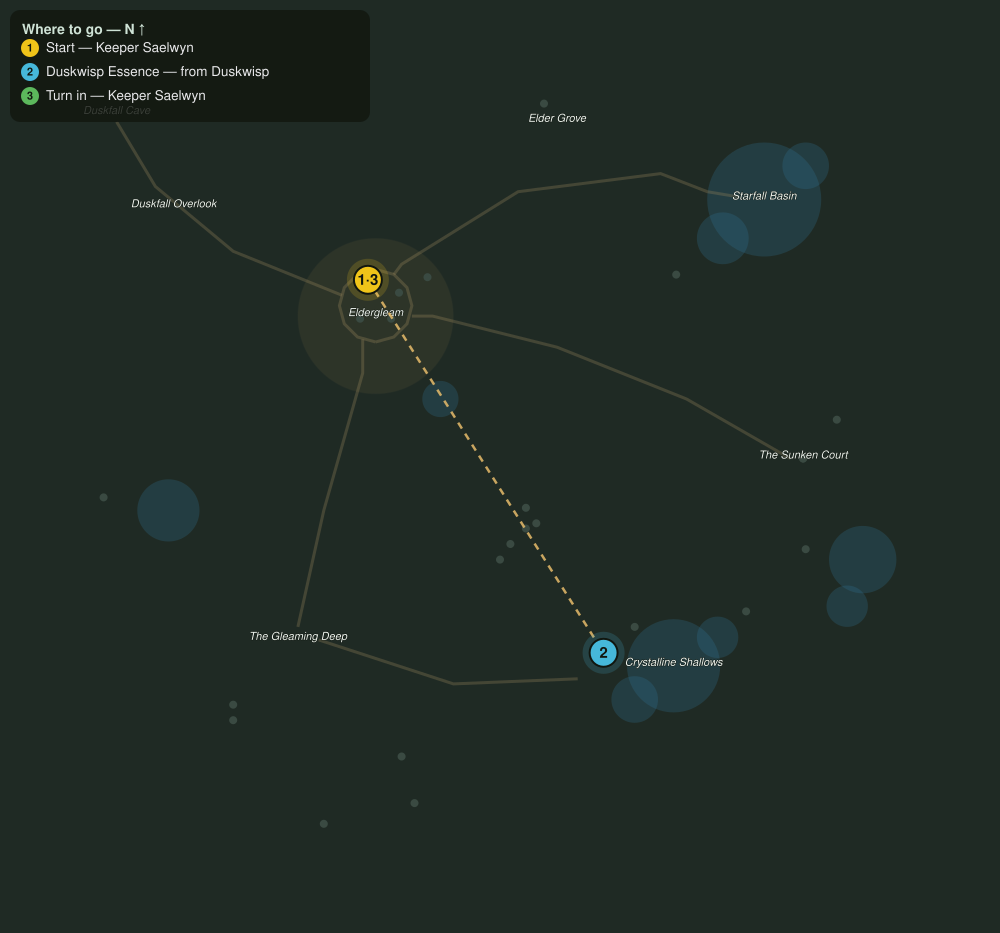

# The Thinned Veil

> Quest ID: `q_veil_thinned` · The Veiled Hollow

| | |
|---|---|
| **Recommended level** | 14+ |
| **Quest giver** | **Keeper Saelwyn**, Keeper of the Hollow _(at ~x:-43, z:1016)_ |
| **Turn in to** | **Keeper Saelwyn**, Keeper of the Hollow _(at ~x:-43, z:1016)_ |

## Story

> So the cave opened for you. Then the seal is weaker than I feared, <your name>. Where the veil tears, the wisps turn dark and cold. Bring me eight essences from the duskwisps and I will read how deep the wound runs.

## How to complete

- **Collect 8× Duskwisp Essence**
  - Drops from [**Duskwisp**](bestiary.md#mob-duskwisp) (60% chance) — Found in the open world at ~x:126, z:1120 (4 mobs, radius 12); Found in the open world at ~x:-30, z:1200 (4 mobs, radius 14)
  - _Tracker: Duskwisp Essence_

Then return to **Keeper Saelwyn**, Keeper of the Hollow _(at ~x:-43, z:1016)_ to turn in.

## Rewards

- **XP:** 3600
- **Money:** 1600 copper

## On completion

> Cold, every one of them. The Hollow has perhaps a season before the tear becomes a rift. We have work to do, you and I.

## Leads to

- Calming the Deep (`q_calming_the_deep`)
- Menace in the Glade (`q_grove_menace`)

## Where to go

**[🧭 Open this route in 3D →](#/questroute/q_veil_thinned)**

_Numbered route: ① start → objectives → 3 turn in. Faint dots are the rest of the zone for context — see the [full zone map](README.md). Mob names above link to the [bestiary](bestiary.md)._
