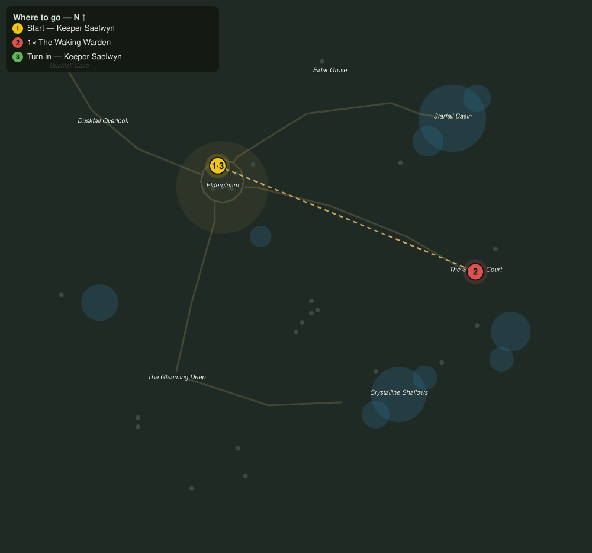

# The Waking Warden

> Quest ID: `q_waking_warden` · The Veiled Hollow

| | |
|---|---|
| **Recommended level** | 18+ |
| **Quest giver** | **Keeper Saelwyn**, Keeper of the Hollow _(at ~x:-43, z:1016)_ |
| **Turn in to** | **Keeper Saelwyn**, Keeper of the Hollow _(at ~x:-43, z:1016)_ |
| **Requires** | The Sunken Court (`q_sunken_court`) |
| **Group quest** | 👥 Suggested players: 2 |

## Story

> The court is quiet, but its master is not. The Warden that holds the seal has woken twisted, and while it stands, the seal cannot be mended. It will not fall easily; bring a friend if you can find one, <your name>. Bring two if you can find two.

## How to complete

- **Kill 1× [The Waking Warden](bestiary.md#mob-waking_warden)** (level 20–20, **Elite**)
  - Found in the open world at ~x:125, z:1085 (1 mob, radius 3)
  - _Tracker: The Waking Warden defeated_

Then return to **Keeper Saelwyn**, Keeper of the Hollow _(at ~x:-43, z:1016)_ to turn in.

## Rewards

- **XP:** 6000
- **Money:** 3800 copper

## On completion

> The bell of its voice is silent. I felt it from here, like a weight lifted off the whole valley.

## Leads to

- The Seal Restored (`q_seal_restored`)

## Where to go

**[🧭 Open this route in 3D →](#/questroute/q_waking_warden)**

_Numbered route: ① start → objectives → 3 turn in. Faint dots are the rest of the zone for context — see the [full zone map](README.md). Mob names above link to the [bestiary](bestiary.md)._
