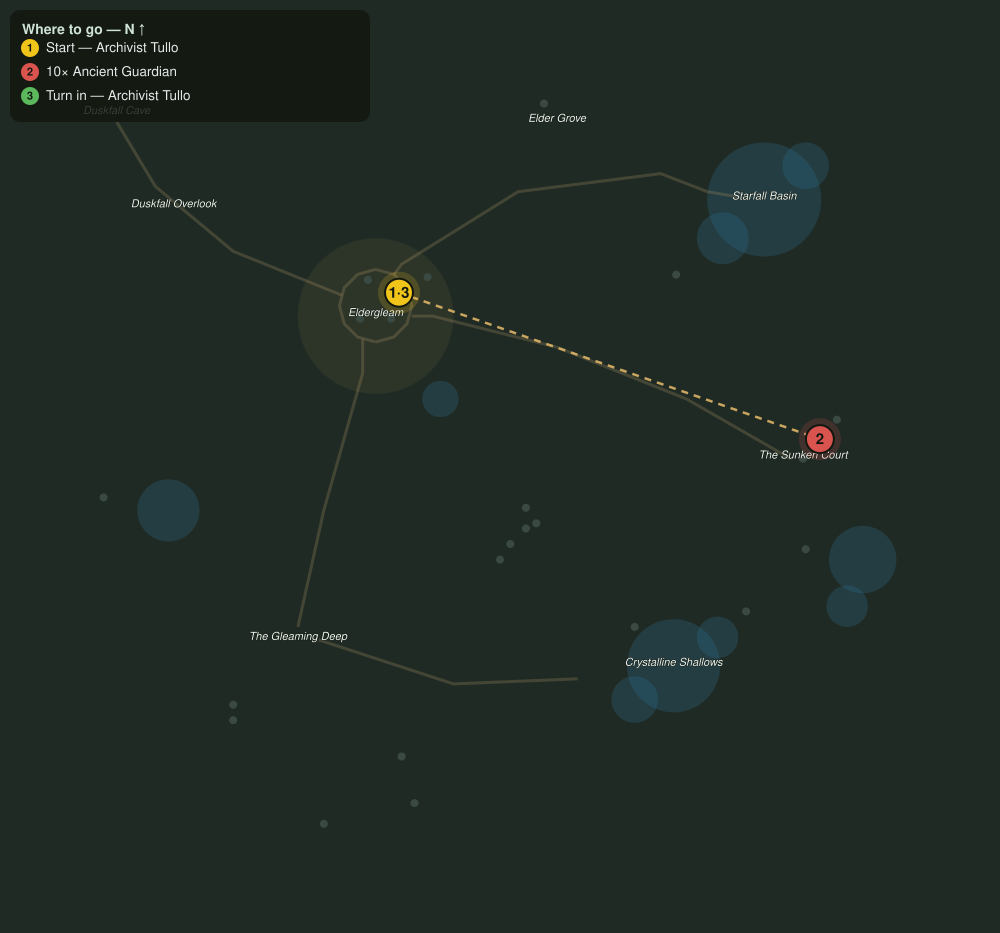

# Echoes of the Warden

> Quest ID: `q_wardens_echoes` · The Veiled Hollow

| | |
|---|---|
| **Recommended level** | 18+ |
| **Quest giver** | **Archivist Tullo**, Reader of Stones _(at ~x:-31, z:1021)_ |
| **Turn in to** | **Archivist Tullo**, Reader of Stones _(at ~x:-31, z:1021)_ |
| **Requires** | The Sunken Court (`q_sunken_court`) |

## Story

> Even with their master silenced, the court guardians repeat its last command like an echo that will not fade. Until the seal is set back, they will keep waking, <your name>. Still ten more of them so the masons can reach the sealstone.

## How to complete

- **Kill 10× [Ancient Guardian](bestiary.md#mob-ancient_guardian)** (level 18–19, **Elite**)
  - Found in the open world at ~x:125, z:1085 (5 mobs, radius 16)
  - Found in the open world at ~x:138, z:1070 (3 mobs, radius 10)
  - _Tracker: Ancient Guardian stilled_

Then return to **Archivist Tullo**, Reader of Stones _(at ~x:-31, z:1021)_ to turn in.

## Rewards

- **XP:** 5200
- **Money:** 2800 copper

## On completion

> The echo grows fainter each time. Soon the court will hold nothing but wind and ivy, the way a ruin should.

## Where to go

**[🧭 Open this route in 3D →](#/questroute/q_wardens_echoes)**

_Numbered route: ① start → objectives → 3 turn in. Faint dots are the rest of the zone for context — see the [full zone map](README.md). Mob names above link to the [bestiary](bestiary.md)._
