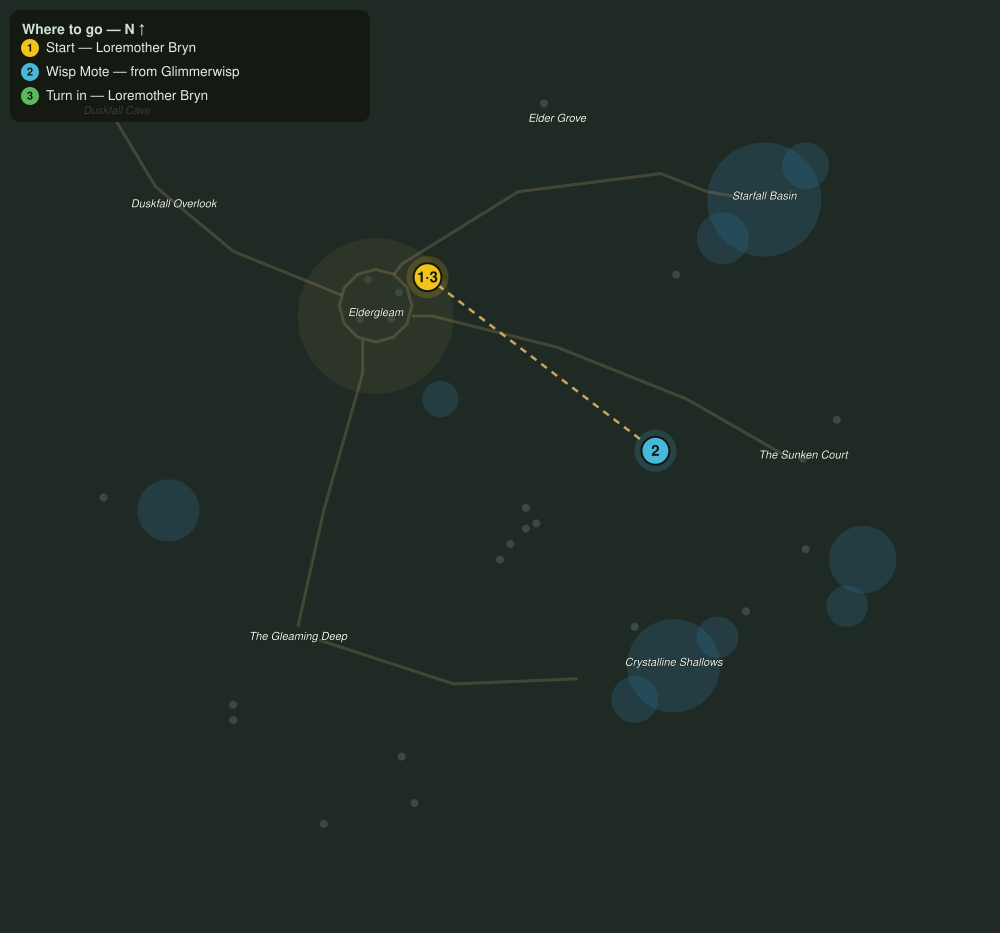

# Lights of the Shallows

> Quest ID: `q_wisp_lights` · The Veiled Hollow

| | |
|---|---|
| **Recommended level** | 14+ |
| **Quest giver** | **Loremother Bryn**, Voice of the Shrine _(at ~x:-20, z:1015)_ |
| **Turn in to** | **Loremother Bryn**, Voice of the Shrine _(at ~x:-20, z:1015)_ |

## Story

> The glimmerwisps carry motes of the old starlight that fell here when the Hollow was sealed. Six motes, and the shrine lamps will burn for a year. Take only from those that fade; the Hollow gives enough without greed.

## How to complete

- **Collect 6× Wisp Mote**
  - Drops from [**Glimmerwisp**](bestiary.md#mob-glimmerwisp) (60% chance) — Found in the open world at ~x:76, z:1014 (4 mobs, radius 12); Found in the open world at ~x:60, z:1150 (4 mobs, radius 14)
  - _Tracker: Wisp Mote_

Then return to **Loremother Bryn**, Voice of the Shrine _(at ~x:-20, z:1015)_ to turn in.

## Rewards

- **XP:** 3400
- **Money:** 1500 copper

## On completion

> Soft as the first stars. Set them here by the altar; the shrine will do the rest.

## Where to go

**[🧭 Open this route in 3D →](#/questroute/q_wisp_lights)**

_Numbered route: ① start → objectives → 3 turn in. Faint dots are the rest of the zone for context — see the [full zone map](README.md). Mob names above link to the [bestiary](bestiary.md)._
