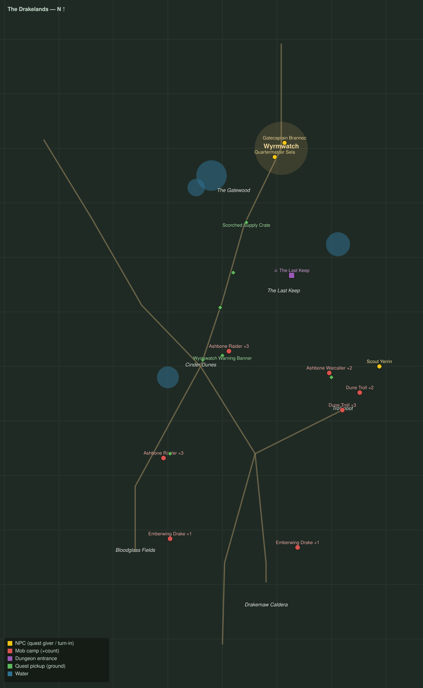

# The Drakelands

Level range: **16–20** · Hub: Wyrmwatch · 8 quests

_Gold = NPCs · red = mob camps (×count) · purple = dungeon entrances · green = ground pickups · blue = water._

📖 **[Bestiary for this zone](bestiary.md)** — every mob's health, armor, damage, and how to kill it.

| Lvl | Quest | Giver | Type |
|----:|-------|-------|------|
| 16 | [Ash on the Wind](q-dk-ash-on-the-wind.md) | Gatecaptain Brannoc | kill |
| 16 | [Trolls on the Road](q-dk-trolls-on-the-road.md) | Quartermaster Sela | kill |
| 16 | [Marrow and Ash](q-dk-marrow-and-ash.md) | Scout Yerrin | collect |
| 17 | [Scorched Stores](q-dk-scorched-stores.md) | Quartermaster Sela | interact |
| 17 | [Banners over the Dunes](q-dk-banners-over-the-dunes.md) | Gatecaptain Brannoc | kill/interact |
| 18 | [The Watcher at the Wargate](q-dk-watcher-at-the-wargate.md) | Gatecaptain Brannoc | interact |
| 19 | [Scales of the Maw](q-dk-scales-of-the-maw.md) 👥 | Scout Yerrin | collect |
| 19 | [Matriarch of the Maw](q-dk-matriarch-of-the-maw.md) 👥 | Scout Yerrin | kill |
