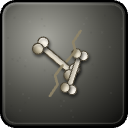
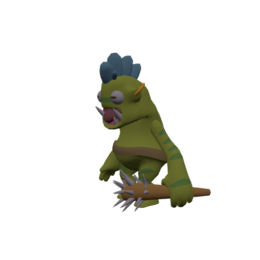
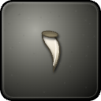
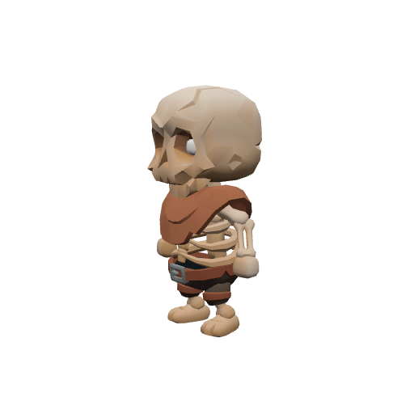

# Bestiary — The Drakelands

5 creatures you'll fight in this zone. Health/armor/damage are shown across the mob's spawn level range (mobs roll a random level within it). Mitigation % is what a same-level attacker's physical hits lose to armor — spells ignore armor.

> Threat tiers: **Boss** (dungeon, group it) · **Elite** (~2.3× HP, ~1.5× damage) · **Rare** (tough roamer) · normal (everything else).

## Common creatures

### Ashbone Raider

| Stat | Value |
|---|---|
| Level | 17–18 |
| Family | Undead |
| Health | 338–356 HP |
| Armor (physical mitigation) | 192–204 (~9–10% vs a same-level attacker) |
| Melee damage | 36–59 per hit @ 1.9s swing (~24–26 DPS) |
| Location | The Drakelands · ~x:356, z:2086 · ~x:296, z:2184 — [🗺️ show on map](#/map/356/2086) |

**Best way to kill:**

- Straightforward melee attacker — tank it, heal as needed, and burn it down. No special tricks.

**Loot:**

- Coins: 90 copper (always drops)

| Item | Type | Drop chance | Notes |
|---|---|---:|---|
|   Ashbone War-Brand | Quest item | 60% | quest item — only drops while on _Marrow and Ash_ |
|  ⚪ Bone Fragments | Junk | 40% | sells for 7c |

### Dune Troll

| Stat | Value |
|---|---|
| Level | 17–19 |
| Family | Troll |
| Health | 418–462 HP |
| Armor (physical mitigation) | 224–252 (~11% vs a same-level attacker) |
| Melee damage | 42–71 per hit @ 2.3s swing (~23–25 DPS) |
| Location | The Drakelands · ~x:460, z:2140 · ~x:476, z:2124 — [🗺️ show on map](#/map/460/2140) |

**Best way to kill:**

- Straightforward melee attacker — tank it, heal as needed, and burn it down. No special tricks.

**Loot:**

- Coins: 90 copper (always drops)

| Item | Type | Drop chance | Notes |
|---|---|---:|---|
|  ⚫ Chipped Tusk | Junk | 40% | sells for 15c |

### Ashbone Warcaller

| Stat | Value |
|---|---|
| Level | 18–19 |
| Family | Undead |
| Health | 402–422 HP |
| Armor (physical mitigation) | 221–234 (~10% vs a same-level attacker) |
| Melee damage | 42–69 per hit @ 2.1s swing (~26–27 DPS) |
| Location | The Drakelands · ~x:448, z:2106 — [🗺️ show on map](#/map/448/2106) |

**Best way to kill:**

- Straightforward melee attacker — tank it, heal as needed, and burn it down. No special tricks.

**Loot:**

- Coins: 95 copper (always drops)

| Item | Type | Drop chance | Notes |
|---|---|---:|---|
|   Ashbone War-Brand | Quest item | 60% | quest item — only drops while on _Marrow and Ash_ |
|  ⚪ Bone Fragments | Junk | 40% | sells for 7c |

## Elites

### Cindraleth the Maw Matriarch — _Elite_

| Stat | Value |
|---|---|
| Level | 20 |
| Family | Dragonkin |
| Health | 1964 HP |
| Armor (physical mitigation) | 342 (~14% vs a same-level attacker) |
| Melee damage | 95–148 per hit @ 2.3s swing (~53 DPS) |
| Respawn | ~25s |
| Location | The Drakelands |

**Best way to kill:**

- **Elite** — ~2.3× the health and ~1.5× the damage of a normal mob; bring a group or out-level it.
- Straightforward melee attacker — tank it, heal as needed, and burn it down. No special tricks.

**Loot:**

- Coins: 100 copper (always drops)

### Drakemaw Broodlord — _Elite · Rare_

| Stat | Value |
|---|---|
| Level | 20 |
| Family | Dragonkin |
| Health | 1831 HP |
| Armor (physical mitigation) | 323 (~13% vs a same-level attacker) |
| Melee damage | 89–139 per hit @ 2.4s swing (~48 DPS) |
| Respawn | ~2 min (rare spawn) |
| Location | The Drakelands · ~x:419, z:2266 · ~x:288, z:2278 — [🗺️ show on map](#/map/419/2266) |

**Best way to kill:**

- **Elite** — ~2.3× the health and ~1.5× the damage of a normal mob; bring a group or out-level it.
- Straightforward melee attacker — tank it, heal as needed, and burn it down. No special tricks.

**Loot:**

- Coins: 100 copper (always drops)

| Item | Type | Drop chance | Notes |
|---|---|---:|---|
|   Emberwing Scale | Quest item | 90% | quest item — only drops while on _Scales of the Maw_ |

---

[← Back to The Drakelands quests](README.md) · [Zone map](map.svg)
