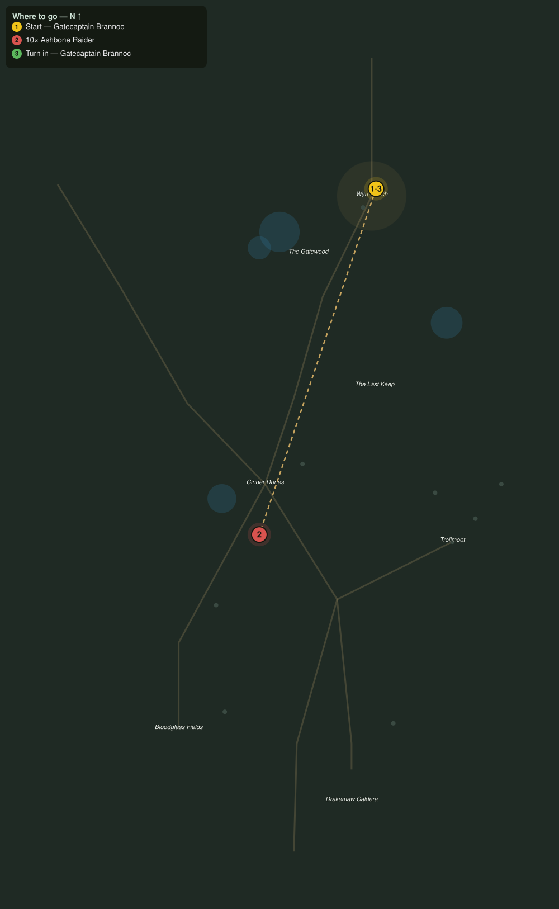

# Ash on the Wind

> Quest ID: `q_dk_ash_on_the_wind` · The Drakelands

| | |
|---|---|
| **Recommended level** | 16+ |
| **Quest giver** | **Gatecaptain Brannoc**, Commander of Wyrmwatch _(at ~x:407, z:1895)_ |
| **Turn in to** | **Gatecaptain Brannoc**, Commander of Wyrmwatch _(at ~x:407, z:1895)_ |

## Story

> Look south off the palisade, <your name>. Those fires in the dunes are not troll cookfires, they are ashbone musters, and every night there are more. The dead come up out of the bonefields with sand still in their teeth. Cut down ten raiders before they cut a road to my gate.

## How to complete

- **Kill 10× [Ashbone Raider](bestiary.md#mob-ashbone_raider)** (level 17–18)
  - Found in the open world at ~x:356, z:2086 (3 mobs, radius 10)
  - Found in the open world at ~x:296, z:2184 (3 mobs, radius 10)
  - _Tracker: Ashbone Raider slain_

Then return to **Gatecaptain Brannoc**, Commander of Wyrmwatch _(at ~x:407, z:1895)_ to turn in.

## Rewards

- **XP:** 3800
- **Money:** 1800 copper

## On completion

> Ten fewer blades in the dunes, and the muster fires burned lower last night. My sentries slept, which they have not done in a week. Well cut, $N.

## Leads to

- Banners over the Dunes (`q_dk_banners_over_the_dunes`)

## Where to go

**[🧭 Open this route in 3D →](#/questroute/q_dk_ash_on_the_wind)**

_Numbered route: ① start → objectives → 3 turn in. Faint dots are the rest of the zone for context — see the [full zone map](README.md). Mob names above link to the [bestiary](bestiary.md)._
