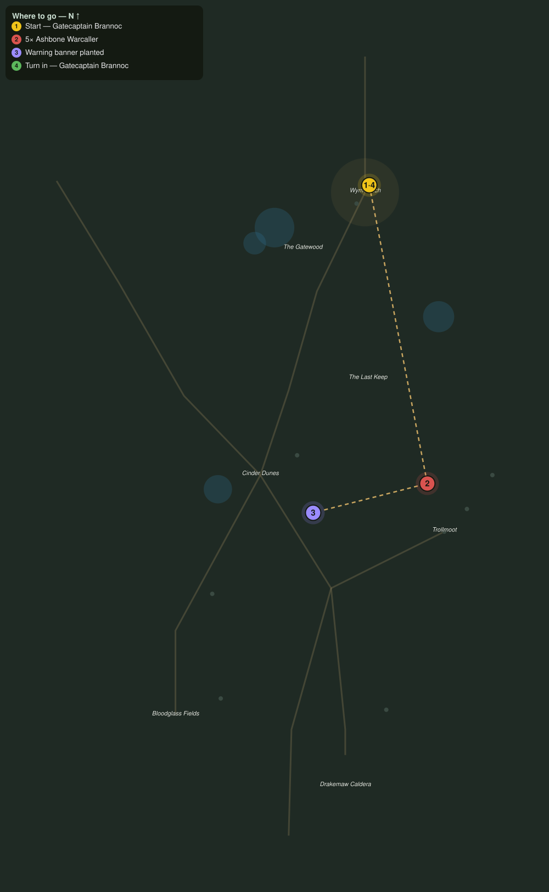

# Banners over the Dunes

> Quest ID: `q_dk_banners_over_the_dunes` · The Drakelands

| | |
|---|---|
| **Recommended level** | 17+ |
| **Quest giver** | **Gatecaptain Brannoc**, Commander of Wyrmwatch _(at ~x:407, z:1895)_ |
| **Turn in to** | **Gatecaptain Brannoc**, Commander of Wyrmwatch _(at ~x:407, z:1895)_ |
| **Requires** | Ash on the Wind (`q_dk_ash_on_the_wind`) |

## Story

> The ashbone muster at the old bonefield graves, <your name>, and my patrols cannot read the dunes the way they read a wall. Kill five of their warcallers, the ones that scream the dead upright, and plant a warning banner on each muster ground so my sentries can mark it from the ridge.

## How to complete

- **Kill 5× [Ashbone Warcaller](bestiary.md#mob-ashbone_warcaller)** (level 18–19)
  - Found in the open world at ~x:448, z:2106 (2 mobs, radius 8)
  - Found in the open world at ~x:302, z:2180 (2 mobs, radius 8)
  - _Tracker: Ashbone Warcaller slain_
- **Interact 3× with Wyrmwatch Warning Banner**
  - Locations: ~x:350, z:2090 · ~x:302, z:2180 · ~x:450, z:2110
  - _Tracker: Warning banner planted_

Then return to **Gatecaptain Brannoc**, Commander of Wyrmwatch _(at ~x:407, z:1895)_ to turn in.

## Rewards

- **XP:** 4800
- **Money:** 2600 copper

## On completion

> Three banners snapping in the hot wind, right where my glass can find them. With five warcallers silenced, whatever answers their call will come slower. You bought us time, $N.

## Leads to

- The Watcher at the Wargate (`q_dk_watcher_at_the_wargate`)

## Where to go

**[🧭 Open this route in 3D →](#/questroute/q_dk_banners_over_the_dunes)**

_Numbered route: ① start → objectives → 4 turn in. Faint dots are the rest of the zone for context — see the [full zone map](README.md). Mob names above link to the [bestiary](bestiary.md)._
