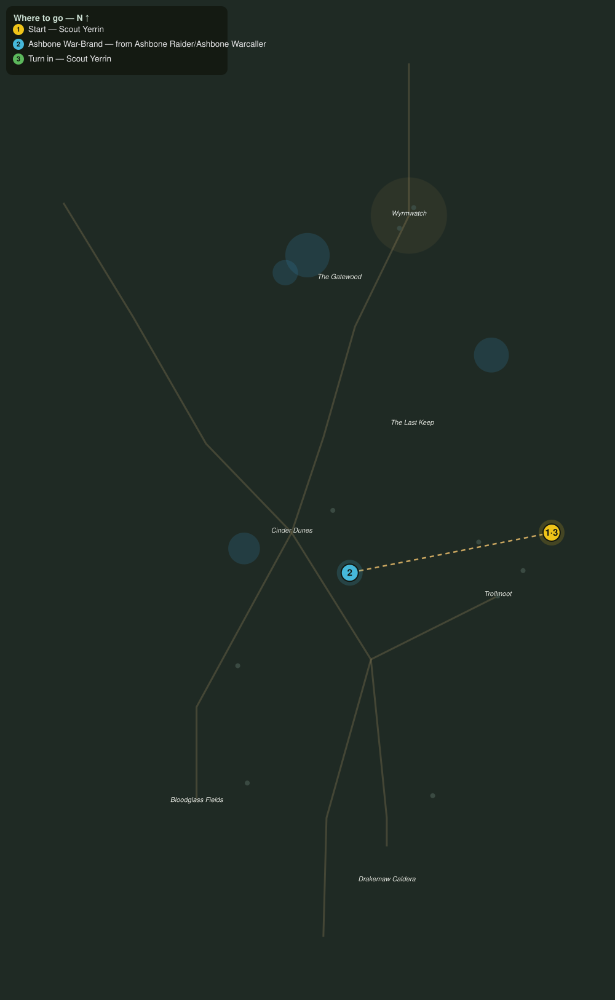

# Marrow and Ash

> Quest ID: `q_dk_marrow_and_ash` · The Drakelands

| | |
|---|---|
| **Recommended level** | 16+ (zone range 16–20) |
| **Quest giver** | **Scout Yerrin**, Far-Dune Watcher _(at ~x:494, z:2100)_ |
| **Turn in to** | **Scout Yerrin**, Far-Dune Watcher _(at ~x:494, z:2100)_ |
| **Requires** | The Watcher at the Wargate (`q_dk_watcher_at_the_wargate`) |

## Story

> Every ashbone raider carries a war-brand, <your name>: a scorched tally of the host it marches under. I have counted four hosts from this ridge, but guesses are not intelligence. Bring me six brands off the raiders and their warcallers, and I will give Brannoc the shape of the war that is coming.

## How to complete

- **Collect 6× Ashbone War-Brand**
  - Drops from [**Ashbone Raider**](bestiary.md#mob-ashbone_raider) (60% chance) — Found in the open world at ~x:356, z:2086 (3 mobs, radius 10); Found in the open world at ~x:296, z:2184 (3 mobs, radius 10)
  - Drops from [**Ashbone Warcaller**](bestiary.md#mob-ashbone_warcaller) (60% chance) — Found in the open world at ~x:448, z:2106 (2 mobs, radius 8); Found in the open world at ~x:302, z:2180 (2 mobs, radius 8)
  - _Tracker: Ashbone War-Brand_

Then return to **Scout Yerrin**, Far-Dune Watcher _(at ~x:494, z:2100)_ to turn in.

## Rewards

- **XP:** 4400
- **Money:** 2200 copper

## On completion

> Six brands, and one mark burned into every one of them. This is no raid muster, $N. Every host in the dunes answers to the wargate below us, the trolls call it Orkadia, and no five soldiers I ever served with could break what drums behind that door. Perhaps five like you.

## Where to go

**[🧭 Open this route in 3D →](#/questroute/q_dk_marrow_and_ash)**

_Numbered route: ① start → objectives → 3 turn in. Faint dots are the rest of the zone for context — see the [full zone map](README.md). Mob names above link to the [bestiary](bestiary.md)._
