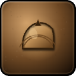
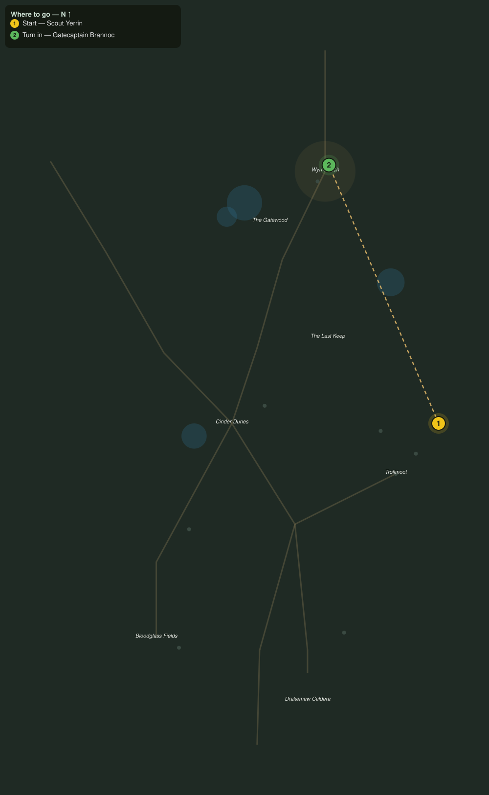

# Matriarch of the Maw

> Quest ID: `q_dk_matriarch_of_the_maw` · The Drakelands

| | |
|---|---|
| **Recommended level** | 19+ |
| **Quest giver** | **Scout Yerrin**, Far-Dune Watcher _(at ~x:494, z:2100)_ |
| **Turn in to** | **Gatecaptain Brannoc**, Commander of Wyrmwatch _(at ~x:407, z:1895)_ |
| **Requires** | Scales of the Maw (`q_dk_scales_of_the_maw`) |
| **Group quest** | 👥 Suggested players: 2 |

## Story

> The scales told it true, <your name>. I climbed the rim at dawn and saw her on the crater floor: Cindraleth, the matriarch every emberwing in this sky was hatched under, gold as a coal about to catch. While she broods, the drakes grow bolder, and Wyrmwatch cannot fight dragons and the ashbone both. End her in her crater, then carry the word to Gatecaptain Brannoc. Do not go alone.

## How to complete

- **Kill 1× [Cindraleth the Maw Matriarch](bestiary.md#mob-cindraleth_maw_matriarch)** (level 20–20, **Elite**)
  - Found in the open world at ~x:436, z:2348 (1 mob, radius 6)
  - _Tracker: Cindraleth the Maw Matriarch slain_

Then return to **Gatecaptain Brannoc**, Commander of Wyrmwatch _(at ~x:407, z:1895)_ to turn in.

## Rewards

- **XP:** 6000
- **Money:** 3600 copper
- **Item reward (by class):**
  -  🔵 Mawscale Pauldrons — _warrior, mage, rogue_ · 72 armor, +6 Sta, +4 Int

## On completion

> The sky over the Drakemaw has been empty for two days, and now you walk through my gate with a matriarch's blood on your boots. Wyrmwatch has stood forty years on watch for exactly this, $N. Take these pauldrons, mawscale, worked by our own smith. Wear them where the drakes can see.

## Where to go

**[🧭 Open this route in 3D →](#/questroute/q_dk_matriarch_of_the_maw)**

_Numbered route: ① start → objectives → 3 turn in. Faint dots are the rest of the zone for context — see the [full zone map](README.md). Mob names above link to the [bestiary](bestiary.md)._
