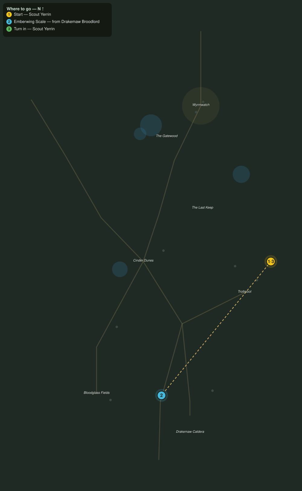

# Scales of the Maw

> Quest ID: `q_dk_scales_of_the_maw` · The Drakelands

| | |
|---|---|
| **Recommended level** | 19+ |
| **Quest giver** | **Scout Yerrin**, Far-Dune Watcher _(at ~x:494, z:2100)_ |
| **Turn in to** | **Scout Yerrin**, Far-Dune Watcher _(at ~x:494, z:2100)_ |
| **Requires** | The Watcher at the Wargate (`q_dk_watcher_at_the_wargate`) |
| **Group quest** | 👥 Suggested players: 2 |

## Story

> When the wind turns off the Drakemaw, the emberwing drakes ride it over my camp low enough to count their teeth, <your name>. They range farther every day, and something in that crater drives them. Bring me three of their scales. Scales remember heat, and I can read where a drake has been roosting by the burn.

## How to complete

- **Collect 3× Emberwing Scale**
  - Drops from [**Emberwing Drake**](bestiary.md#mob-emberwing_drake) (70% chance) — Found in the open world at ~x:419, z:2266 (1 mob, radius 8); Found in the open world at ~x:302, z:2258 (1 mob, radius 8); Found in the open world at ~x:322, z:2252 (1 mob, radius 8)
  - _Tracker: Emberwing Scale_

Then return to **Scout Yerrin**, Far-Dune Watcher _(at ~x:494, z:2100)_ to turn in.

## Rewards

- **XP:** 5000
- **Money:** 2600 copper

## On completion

> Look at the underside of this one, $N: scorched in a spiral, and only one thing nests in circles. These drakes are brood-guards. Something in the Drakemaw is a mother.

## Leads to

- Matriarch of the Maw (`q_dk_matriarch_of_the_maw`)

## Where to go

**[🧭 Open this route in 3D →](#/questroute/q_dk_scales_of_the_maw)**

_Numbered route: ① start → objectives → 3 turn in. Faint dots are the rest of the zone for context — see the [full zone map](README.md). Mob names above link to the [bestiary](bestiary.md)._
