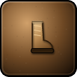
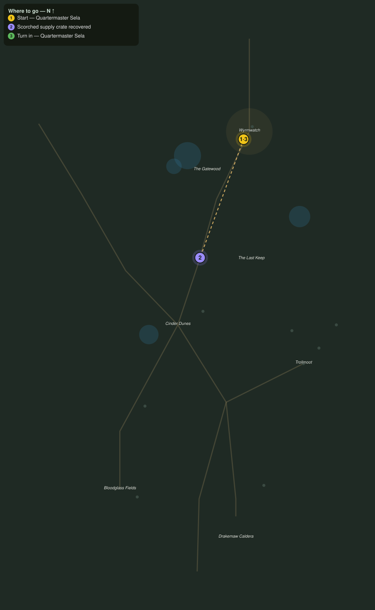

# Scorched Stores

> Quest ID: `q_dk_scorched_stores` · The Drakelands

| | |
|---|---|
| **Recommended level** | 17+ |
| **Quest giver** | **Quartermaster Sela**, Keeper of the Garrison Stores _(at ~x:398, z:1908)_ |
| **Turn in to** | **Quartermaster Sela**, Keeper of the Garrison Stores _(at ~x:398, z:1908)_ |
| **Requires** | Trolls on the Road (`q_dk_trolls_on_the_road`) |

## Story

> The last wagon burned, <your name>, but iron-strapped crates do not burn through. Four of them are still lying scorched along the dunes road with a season of salt, nails, and bowstrings inside. Bring my stores home before the trolls work out how to open them.

## How to complete

- **Interact 4× with Scorched Supply Crate**
  - Locations: ~x:372, z:1968 · ~x:355, z:2013 · ~x:348, z:2046 · ~x:332, z:2094
  - _Tracker: Scorched supply crate recovered_

Then return to **Quartermaster Sela**, Keeper of the Garrison Stores _(at ~x:398, z:1908)_ to turn in.

## Rewards

- **XP:** 4000
- **Money:** 1900 copper
- **Item reward (by class):**
  -  🟢 Cinderwalk Treads — _warrior, mage, rogue_ · 58 armor, +4 Sta, +3 Spi

## On completion

> Scorched black and every latch still holding. The smith gets his nails, the fletcher her strings, and you get the boots I was saving for whoever brought my crates back, $N.

## Where to go

**[🧭 Open this route in 3D →](#/questroute/q_dk_scorched_stores)**

_Numbered route: ① start → objectives → 3 turn in. Faint dots are the rest of the zone for context — see the [full zone map](README.md). Mob names above link to the [bestiary](bestiary.md)._
