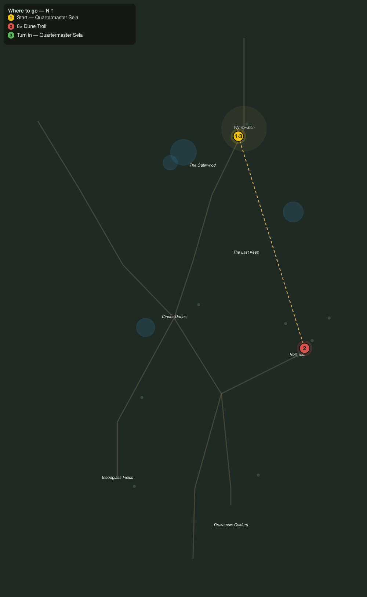

# Trolls on the Road

> Quest ID: `q_dk_trolls_on_the_road` · The Drakelands

| | |
|---|---|
| **Recommended level** | 16+ |
| **Quest giver** | **Quartermaster Sela**, Keeper of the Garrison Stores _(at ~x:398, z:1908)_ |
| **Turn in to** | **Quartermaster Sela**, Keeper of the Garrison Stores _(at ~x:398, z:1908)_ |

## Story

> The dune trolls have learned the sound of a supply wagon, <your name>. They hit the Cinder Dunes road three times this month, and the last driver walked in carrying nothing but the reins. Eight trolls off that road and my wagons roll again.

## How to complete

- **Kill 8× [Dune Troll](bestiary.md#mob-dune_troll)** (level 17–19)
  - Found in the open world at ~x:460, z:2140 (3 mobs, radius 10)
  - Found in the open world at ~x:476, z:2124 (2 mobs, radius 8)
  - _Tracker: Dune Troll slain_

Then return to **Quartermaster Sela**, Keeper of the Garrison Stores _(at ~x:398, z:1908)_ to turn in.

## Rewards

- **XP:** 4200
- **Money:** 2000 copper

## On completion

> Eight, and my drivers have stopped writing farewell letters before every run. The garrison eats because of you, $N.

## Leads to

- Scorched Stores (`q_dk_scorched_stores`)

## Where to go

**[🧭 Open this route in 3D →](#/questroute/q_dk_trolls_on_the_road)**

_Numbered route: ① start → objectives → 3 turn in. Faint dots are the rest of the zone for context — see the [full zone map](README.md). Mob names above link to the [bestiary](bestiary.md)._
