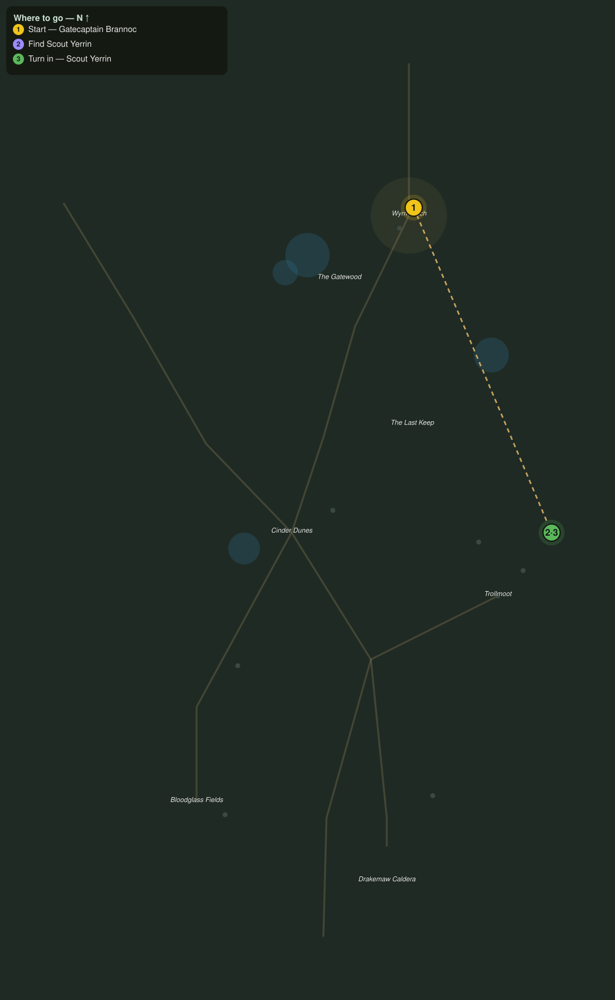

# The Watcher at the Wargate

> Quest ID: `q_dk_watcher_at_the_wargate` · The Drakelands

| | |
|---|---|
| **Recommended level** | 18+ |
| **Quest giver** | **Gatecaptain Brannoc**, Commander of Wyrmwatch _(at ~x:407, z:1895)_ |
| **Turn in to** | **Scout Yerrin**, Far-Dune Watcher _(at ~x:494, z:2100)_ |
| **Requires** | Banners over the Dunes (`q_dk_banners_over_the_dunes`) |

## Story

> Something is pulling the ashbone east, <your name>, and I sent my best to learn what. Scout Yerrin has camped a month in the far dunes past Trollmoot, in sight of a gate nobody built in my lifetime. Her reports stopped ten days ago. Find her camp and get me her eyes.

## How to complete

- **Interact with **Scout Yerrin**, Far-Dune Watcher _(at ~x:494, z:2100)_**
  - _Tracker: Find Scout Yerrin_

Then return to **Scout Yerrin**, Far-Dune Watcher _(at ~x:494, z:2100)_ to turn in.

## Rewards

- **XP:** 2400
- **Money:** 950 copper

## On completion

> Brannoc sent you? Then my last runner never made it. Keep your voice down and sit, $N. You see that gate below? Count the war-banners in front of it, and you will understand why I stopped writing things down.

## Leads to

- Marrow and Ash (`q_dk_marrow_and_ash`)
- Scales of the Maw (`q_dk_scales_of_the_maw`)

## Where to go

**[🧭 Open this route in 3D →](#/questroute/q_dk_watcher_at_the_wargate)**

_Numbered route: ① start → objectives → 3 turn in. Faint dots are the rest of the zone for context — see the [full zone map](README.md). Mob names above link to the [bestiary](bestiary.md)._
