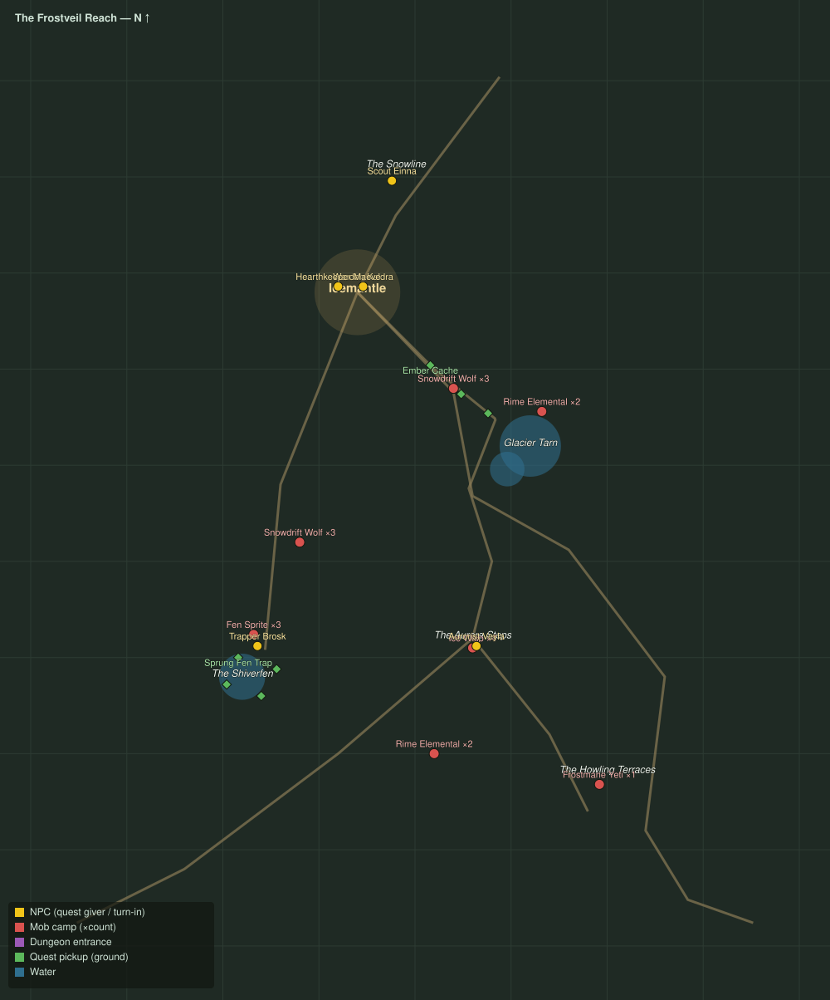

# The Frostveil Reach

Level range: **17–20** · Hub: Icemantle · 12 quests

_Gold = NPCs · red = mob camps (×count) · purple = dungeon entrances · green = ground pickups · blue = water._

📖 **[Bestiary for this zone](bestiary.md)** — every mob's health, armor, damage, and how to kill it.

| Lvl | Quest | Giver | Type |
|----:|-------|-------|------|
| 16 | [Word from the Snowline](q-fv-snowline-report.md) | Scout Einna | interact |
| 17 | [Wolves at the Door](q-fv-wolves-at-the-door.md) | Warden Kaldra | kill |
| 17 | [Pelts for the Lodge](q-fv-winter-pelts.md) | Hearthkeeper Maeve | collect |
| 17 | [Embers on the Tarn Road](q-fv-ember-caches.md) | Hearthkeeper Maeve | interact |
| 17 | [Lights over the Steps](q-fv-lights-over-steps.md) | Warden Kaldra | interact |
| 17 | [Motes of the Aurora](q-fv-aurora-motes.md) | Aurorist Veyla | collect |
| 17 | [Rime Unbound](q-fv-rime-unbound.md) | Aurorist Veyla | kill |
| 17 | [The Silent Trapline](q-fv-silent-trapline.md) | Hearthkeeper Maeve | interact |
| 17 | [Sprites in the Traps](q-fv-sprung-traps.md) | Trapper Brosk | kill/interact |
| 18 | [Seeing Wren Home](q-fv-seeing-wren-home.md) | Trapper Brosk | escort |
| 18 | [The Howl on the Terraces](q-fv-howl-above.md) | Warden Kaldra | kill |
| 19 | [The Frostmane Tyrant](q-fv-frostmane-tyrant.md) 👥 | Warden Kaldra | kill |
