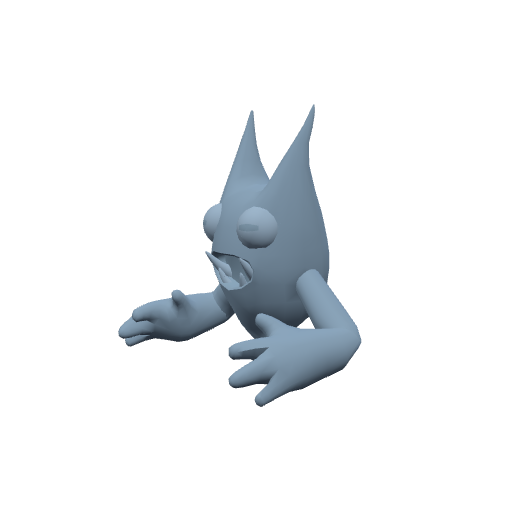
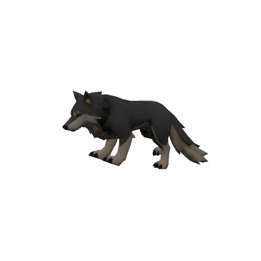
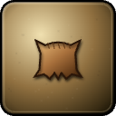
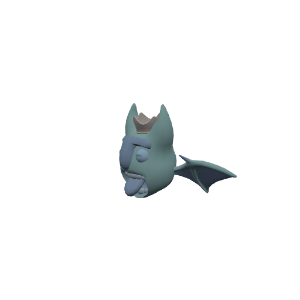
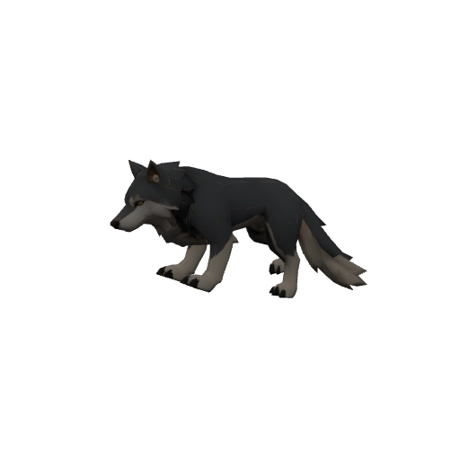
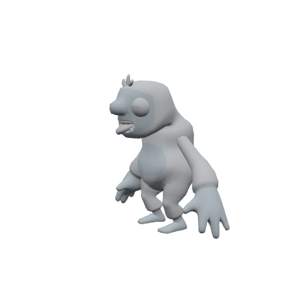

# Bestiary — The Frostveil Reach

6 creatures you'll fight in this zone. Health/armor/damage are shown across the mob's spawn level range (mobs roll a random level within it). Mitigation % is what a same-level attacker's physical hits lose to armor — spells ignore armor.

> Threat tiers: **Boss** (dungeon, group it) · **Elite** (~2.3× HP, ~1.5× damage) · **Rare** (tough roamer) · normal (everything else).

## Common creatures

### Fen Sprite

| Stat | Value |
|---|---|
| Level | 17–18 |
| Family | Kobold |
| Health | 320–337 HP |
| Armor (physical mitigation) | 176–187 (~9% vs a same-level attacker) |
| Melee damage | 34–56 per hit @ 1.9s swing (~23–24 DPS) |
| Location | The Frostveil Reach · ~x:-84, z:1738 — [🗺️ show on map](#/map/-84/1738) |

**Best way to kill:**

- Straightforward melee attacker — tank it, heal as needed, and burn it down. No special tricks.

**Loot:**

- Coins: 80 copper (always drops)

### Ice Wisp

| Stat | Value |
|---|---|
| Level | 17–18 |
| Family | Elemental |
| Health | 300–316 HP |
| Armor (physical mitigation) | 160–170 (~8% vs a same-level attacker) |
| Melee damage | 32–53 per hit @ 2s swing (~21–22 DPS) |
| Location | The Frostveil Reach · ~x:30, z:1745 — [🗺️ show on map](#/map/30/1745) |

**Best way to kill:**

- Straightforward melee attacker — tank it, heal as needed, and burn it down. No special tricks.

**Loot:**

- Coins: 80 copper (always drops)

| Item | Type | Drop chance | Notes |
|---|---|---:|---|
|   Aurora Mote | Quest item | 65% | quest item — only drops while on _Motes of the Aurora_ |

### Snowdrift Wolf

| Stat | Value |
|---|---|
| Level | 17–18 |
| Family | Beast |
| Health | 340–358 HP |
| Armor (physical mitigation) | 192–204 (~9–10% vs a same-level attacker) |
| Melee damage | 36–59 per hit @ 1.8s swing (~26–27 DPS) |
| Location | The Frostveil Reach · ~x:20, z:1610 · ~x:-60, z:1690 — [🗺️ show on map](#/map/20/1610) |

**Best way to kill:**

- Straightforward melee attacker — tank it, heal as needed, and burn it down. No special tricks.

**Loot:**

- Coins: 80 copper (always drops)

| Item | Type | Drop chance | Notes |
|---|---|---:|---|
|   Thick Winter Pelt | Quest item | 60% | quest item — only drops while on _Pelts for the Lodge_ |

### Rime Elemental

| Stat | Value |
|---|---|
| Level | 18–19 |
| Family | Elemental |
| Health | 402–422 HP |
| Armor (physical mitigation) | 238–252 (~11% vs a same-level attacker) |
| Melee damage | 41–68 per hit @ 2.2s swing (~24–25 DPS) |
| Location | The Frostveil Reach · ~x:66, z:1622 · ~x:10, z:1800 — [🗺️ show on map](#/map/66/1622) |

**Best way to kill:**

- Straightforward melee attacker — tank it, heal as needed, and burn it down. No special tricks.

**Loot:**

- Coins: 95 copper (always drops)

### Terrace Howler

| Stat | Value |
|---|---|
| Level | 19–20 |
| Family | Beast |
| Health | 464–486 HP |
| Armor (physical mitigation) | 234–247 (~10–11% vs a same-level attacker) |
| Melee damage | 46–74 per hit @ 1.9s swing (~31–32 DPS) |
| Location | The Frostveil Reach |

**Best way to kill:**

- Straightforward melee attacker — tank it, heal as needed, and burn it down. No special tricks.

**Loot:**

- Coins: 105 copper (always drops)

## Elites

### Frostmane Yeti — _Elite_

| Stat | Value |
|---|---|
| Level | 19–20 |
| Family | Ogre |
| Health | 1518–1587 HP |
| Armor (physical mitigation) | 288–304 (~13% vs a same-level attacker) |
| Melee damage | 78–128 per hit @ 2.4s swing (~42–44 DPS) |
| Respawn | ~25s |
| Location | The Frostveil Reach · ~x:96, z:1816 — [🗺️ show on map](#/map/96/1816) |

**Best way to kill:**

- **Elite** — ~2.3× the health and ~1.5× the damage of a normal mob; bring a group or out-level it.
- Straightforward melee attacker — tank it, heal as needed, and burn it down. No special tricks.

**Loot:**

- Coins: 420 copper (always drops)

---

[← Back to The Frostveil Reach quests](README.md) · [Zone map](map.svg)
