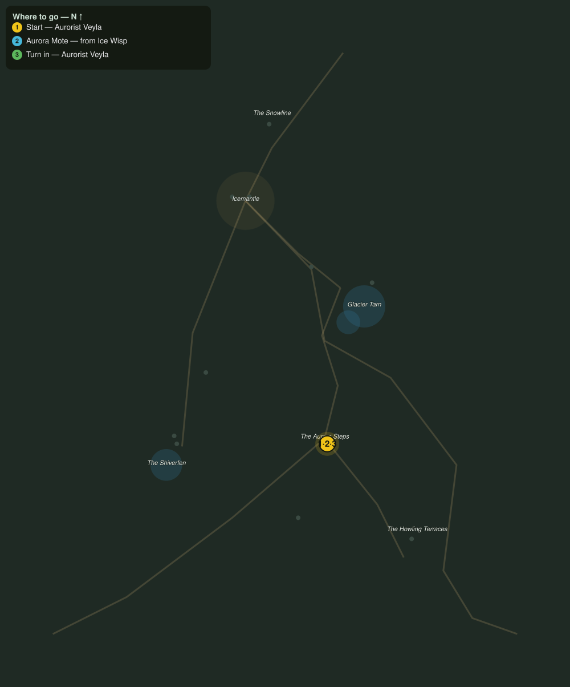

# Motes of the Aurora

> Quest ID: `q_fv_aurora_motes` · The Frostveil Reach

| | |
|---|---|
| **Recommended level** | 17+ (zone range 17–20) |
| **Quest giver** | **Aurorist Veyla**, Reader of the Lights _(at ~x:32, z:1744)_ |
| **Turn in to** | **Aurorist Veyla**, Reader of the Lights _(at ~x:32, z:1744)_ |
| **Requires** | Lights over the Steps (`q_fv_lights_over_steps`) |

## Story

> The wisps that drift these steps are shed by the lights themselves, and each carries a mote of the aurora in its heart. I need six to read what the sky is writing, <your name>. The wisps do not fight back. Whether that makes the work easier or harder is between you and your conscience.

## How to complete

- **Collect 6× Aurora Mote**
  - Drops from [**Ice Wisp**](bestiary.md#mob-ice_wisp) (65% chance) — Found in the open world at ~x:30, z:1745 (4 mobs, radius 12)
  - _Tracker: Aurora Mote_

Then return to **Aurorist Veyla**, Reader of the Lights _(at ~x:32, z:1744)_ to turn in.

## Rewards

- **XP:** 4400
- **Money:** 2200 copper

## On completion

> Six motes, still glowing. Look at them, $N: they pulse in time with each other. The lights are not weather. They are a signal.

## Where to go

**[🧭 Open this route in 3D →](#/questroute/q_fv_aurora_motes)**

_Numbered route: ① start → objectives → 3 turn in. Faint dots are the rest of the zone for context — see the [full zone map](README.md). Mob names above link to the [bestiary](bestiary.md)._
