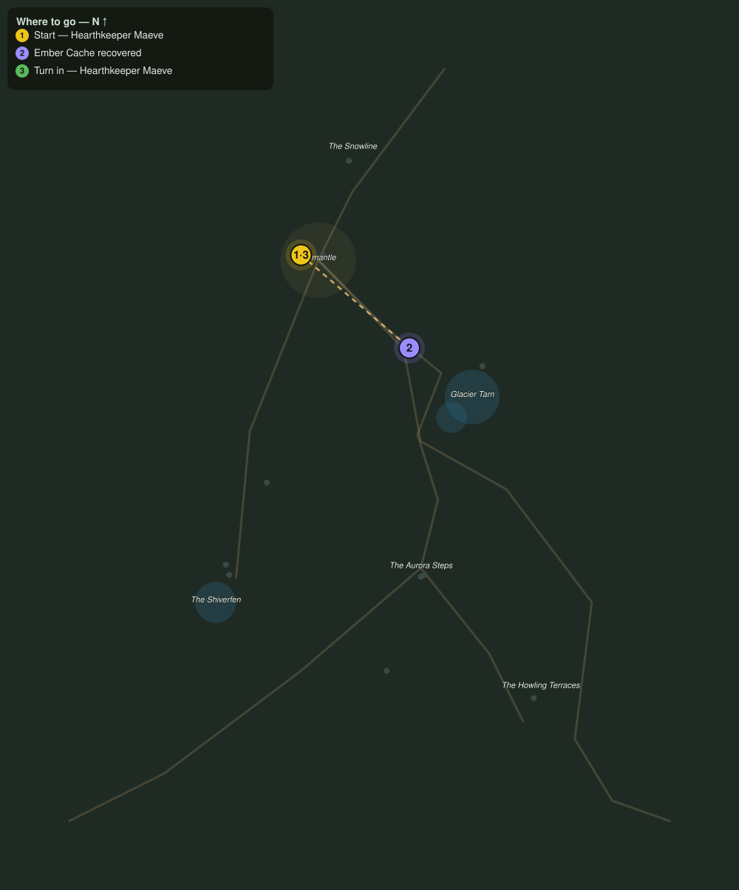

# Embers on the Tarn Road

> Quest ID: `q_fv_ember_caches` · The Frostveil Reach

| | |
|---|---|
| **Recommended level** | 17+ (zone range 17–20) |
| **Quest giver** | **Hearthkeeper Maeve**, Keeper of the Hearth-Lodge _(at ~x:-40, z:1557)_ |
| **Turn in to** | **Hearthkeeper Maeve**, Keeper of the Hearth-Lodge _(at ~x:-40, z:1557)_ |
| **Requires** | Word from the Snowline (`q_fv_snowline_report`) |

## Story

> A sledge of ember caches overturned on the tarn road in last night: iron kettles that hold a banked fire alive for a month. Three of them are still lying in the snow, <your name>, and the lodge cannot spare what they hold. Bring the fire home.

## How to complete

- **Interact 3× with Ember Cache**
  - Locations: ~x:8, z:1598 · ~x:24, z:1613 · ~x:38, z:1623
  - _Tracker: Ember Cache recovered_

Then return to **Hearthkeeper Maeve**, Keeper of the Hearth-Lodge _(at ~x:-40, z:1557)_ to turn in.

## Rewards

- **XP:** 4000
- **Money:** 1900 copper

## On completion

> Still warm, every one. You have bought the lodge a whole winter of mercy, $N.

## Where to go

**[🧭 Open this route in 3D →](#/questroute/q_fv_ember_caches)**

_Numbered route: ① start → objectives → 3 turn in. Faint dots are the rest of the zone for context — see the [full zone map](README.md). Mob names above link to the [bestiary](bestiary.md)._
