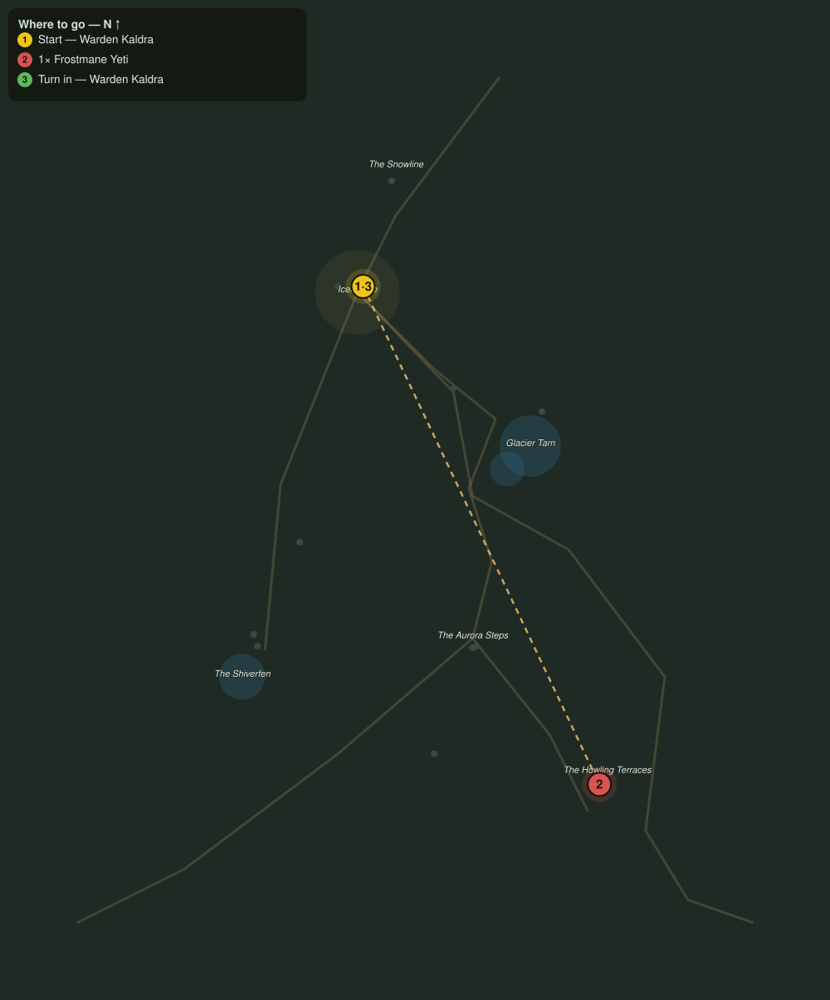

# The Frostmane Tyrant

> Quest ID: `q_fv_frostmane_tyrant` · The Frostveil Reach

| | |
|---|---|
| **Recommended level** | 19+ |
| **Quest giver** | **Warden Kaldra**, Warden of Icemantle _(at ~x:-27, z:1557)_ |
| **Turn in to** | **Warden Kaldra**, Warden of Icemantle _(at ~x:-27, z:1557)_ |
| **Requires** | The Howl on the Terraces (`q_fv_howl_above`) |
| **Group quest** | 👥 Suggested players: 2 |

## Story

> The howlers were not hunting when they came down the terraces. They were fleeing. A yeti has claimed the high ground, the mountain folk call it the Frostmane, and even the packs will not share a slope with it. It has to end, <your name>, before winter drives it down to my walls. Bring a friend. Bring two.

## How to complete

- **Kill 1× [Frostmane Yeti](bestiary.md#mob-frostmane_yeti)** (level 19–20, **Elite**)
  - Found in the open world at ~x:96, z:1816 (1 mob, radius 6)
  - _Tracker: The Frostmane slain_

Then return to **Warden Kaldra**, Warden of Icemantle _(at ~x:-27, z:1557)_ to turn in.

## Rewards

- **XP:** 6000
- **Money:** 3600 copper
- **Item reward (by class):**
  -  🔵 Mantle of the Frostmane — _warrior, mage, rogue_ · 72 armor, +4 Str, +6 Sta

## On completion

> When the wind dropped last night the whole village heard the silence where the Frostmane used to be. The Reach owes you a debt it will be years in paying, $N. Wear this, and every door in Icemantle is open to you.

## Where to go

**[🧭 Open this route in 3D →](#/questroute/q_fv_frostmane_tyrant)**

_Numbered route: ① start → objectives → 3 turn in. Faint dots are the rest of the zone for context — see the [full zone map](README.md). Mob names above link to the [bestiary](bestiary.md)._
