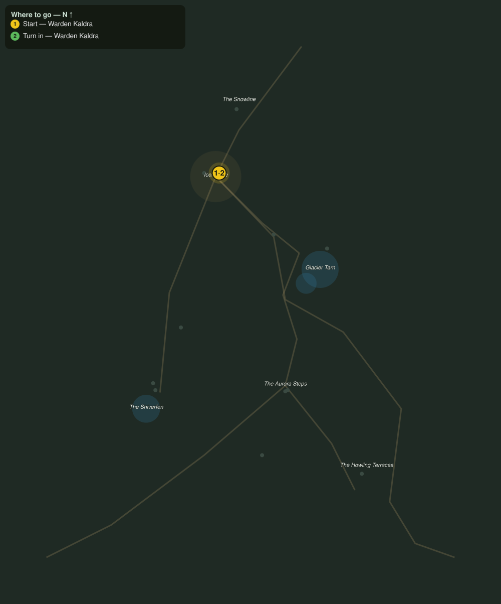

# The Howl on the Terraces

> Quest ID: `q_fv_howl_above` · The Frostveil Reach

| | |
|---|---|
| **Recommended level** | 18+ |
| **Quest giver** | **Warden Kaldra**, Warden of Icemantle _(at ~x:-27, z:1557)_ |
| **Turn in to** | **Warden Kaldra**, Warden of Icemantle _(at ~x:-27, z:1557)_ |
| **Requires** | Lights over the Steps (`q_fv_lights_over_steps`) |

## Story

> You hear it at dusk, <your name>: a howl off the Howling Terraces that is not the snowdrift packs. Bigger throats. The terrace howlers have come down from the peaks for the first time since my grandmother held this post, and they are what pushed the wolves onto my road. Cull eight and push them back.

## How to complete

- **Kill 8× [Terrace Howler](bestiary.md#mob-terrace_howler)** (level 19–20)
  - Found in the open world at ~x:112, z:1800 (3 mobs, radius 10)
  - Found in the open world at ~x:84, z:1830 (3 mobs, radius 9)
  - _Tracker: Terrace Howler slain_

Then return to **Warden Kaldra**, Warden of Icemantle _(at ~x:-27, z:1557)_ to turn in.

## Rewards

- **XP:** 5000
- **Money:** 2600 copper

## On completion

> Eight, and the dusk chorus is thinner for it. But howlers do not leave the peaks for nothing. Something up there moved them, and I fear it has a name.

## Leads to

- The Frostmane Tyrant (`q_fv_frostmane_tyrant`)

## Where to go

**[🧭 Open this route in 3D →](#/questroute/q_fv_howl_above)**

_Numbered route: ① start → objectives → 3 turn in. Faint dots are the rest of the zone for context — see the [full zone map](README.md). Mob names above link to the [bestiary](bestiary.md)._
