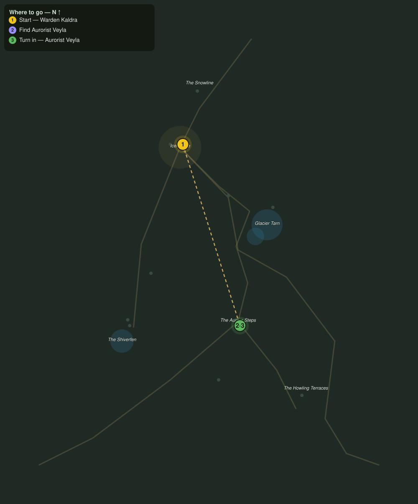

# Lights over the Steps

> Quest ID: `q_fv_lights_over_steps` · The Frostveil Reach

| | |
|---|---|
| **Recommended level** | 17+ |
| **Quest giver** | **Warden Kaldra**, Warden of Icemantle _(at ~x:-27, z:1557)_ |
| **Turn in to** | **Aurorist Veyla**, Reader of the Lights _(at ~x:32, z:1744)_ |
| **Requires** | Wolves at the Door (`q_fv_wolves_at_the_door`) |

## Story

> The aurora has burned green every night this month, and the old folk will not walk under it. One woman might know why: Veyla, the Aurorist. She camps alone on the Aurora Steps, southeast past the tarn. Find her camp, <your name>, and hear what the lights have told her.

## How to complete

- **Interact with **Aurorist Veyla**, Reader of the Lights _(at ~x:32, z:1744)_**
  - _Tracker: Find Aurorist Veyla_

Then return to **Aurorist Veyla**, Reader of the Lights _(at ~x:32, z:1744)_ to turn in.

## Rewards

- **XP:** 2600
- **Money:** 1000 copper

## On completion

> Kaldra sent you? Then she is finally worried, and she is right to be. Sit, $N. Watch the sky with me a while.

## Leads to

- Motes of the Aurora (`q_fv_aurora_motes`)
- Rime Unbound (`q_fv_rime_unbound`)
- The Howl on the Terraces (`q_fv_howl_above`)

## Where to go

**[🧭 Open this route in 3D →](#/questroute/q_fv_lights_over_steps)**

_Numbered route: ① start → objectives → 3 turn in. Faint dots are the rest of the zone for context — see the [full zone map](README.md). Mob names above link to the [bestiary](bestiary.md)._
