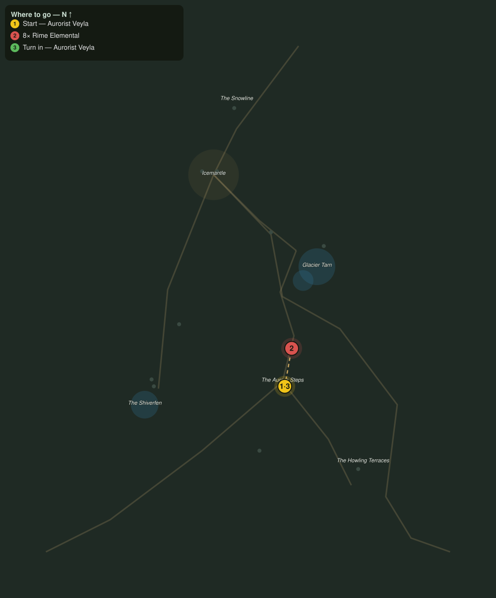

# Rime Unbound

> Quest ID: `q_fv_rime_unbound` · The Frostveil Reach

| | |
|---|---|
| **Recommended level** | 17+ (zone range 17–20) |
| **Quest giver** | **Aurorist Veyla**, Reader of the Lights _(at ~x:32, z:1744)_ |
| **Turn in to** | **Aurorist Veyla**, Reader of the Lights _(at ~x:32, z:1744)_ |
| **Requires** | Lights over the Steps (`q_fv_lights_over_steps`) |

## Story

> When the aurora burns this bright, the cold stands up and walks: rime elementals, frost given a will. They gather where the lights touch the benches, and they are wandering closer to my camp each night. Break eight of them apart, <your name>, before one of them breaks me.

## How to complete

- **Kill 8× [Rime Elemental](bestiary.md#mob-rime_elemental)** (level 18–19)
  - Found in the open world at ~x:66, z:1622 (2 mobs, radius 9)
  - Found in the open world at ~x:10, z:1800 (2 mobs, radius 10)
  - _Tracker: Rime Elemental slain_

Then return to **Aurorist Veyla**, Reader of the Lights _(at ~x:32, z:1744)_ to turn in.

## Rewards

- **XP:** 4400
- **Money:** 2400 copper

## On completion

> The night feels thinner already. Whatever wakes them is not done, but you have bought the Steps some quiet.

## Where to go

**[🧭 Open this route in 3D →](#/questroute/q_fv_rime_unbound)**

_Numbered route: ① start → objectives → 3 turn in. Faint dots are the rest of the zone for context — see the [full zone map](README.md). Mob names above link to the [bestiary](bestiary.md)._
