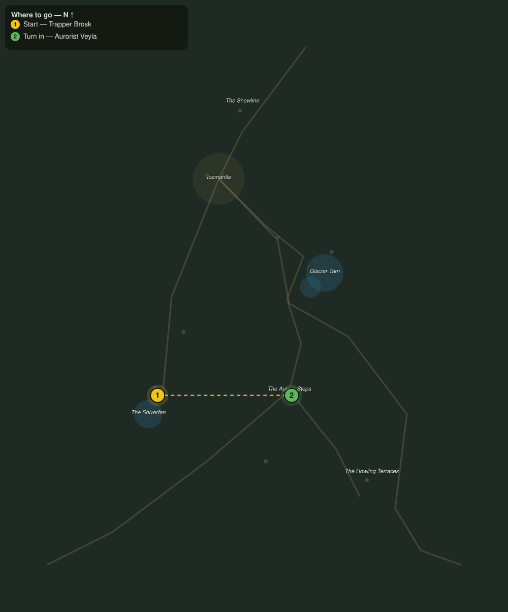

# Seeing Wren Home

> Quest ID: `q_fv_seeing_wren_home` · The Frostveil Reach

| | |
|---|---|
| **Recommended level** | 18+ |
| **Quest giver** | **Trapper Brosk**, Shiverfen Trapper _(at ~x:-82, z:1744)_ |
| **Turn in to** | **Aurorist Veyla**, Reader of the Lights _(at ~x:32, z:1744)_ |
| **Requires** | Sprites in the Traps (`q_fv_sprung_traps`) |

## Story

> My apprentice Wren went out to walk the Goldmelt line two days ago and never came back. I found her tracks, she is holed up under the road markers northeast of the Aurora Steps, too scared of the wolves to move. I cannot leave the fen, <your name>. Walk her to Veyla's camp on the Steps. She will be safe under the lights.

## How to complete

  - _Tracker: Apprentice Wren seen safely to the Aurora Steps_

Then return to **Aurorist Veyla**, Reader of the Lights _(at ~x:32, z:1744)_ to turn in.

## Rewards

- **XP:** 5400
- **Money:** 3000 copper

## On completion

> The girl is inside, wrapped in half my blankets and talking the stars out of the sky. You did a kind thing today, $N. The Reach doesn't see many of those.

## Where to go

**[🧭 Open this route in 3D →](#/questroute/q_fv_seeing_wren_home)**

_Numbered route: ① start → objectives → 3 turn in. Faint dots are the rest of the zone for context — see the [full zone map](README.md). Mob names above link to the [bestiary](bestiary.md)._
