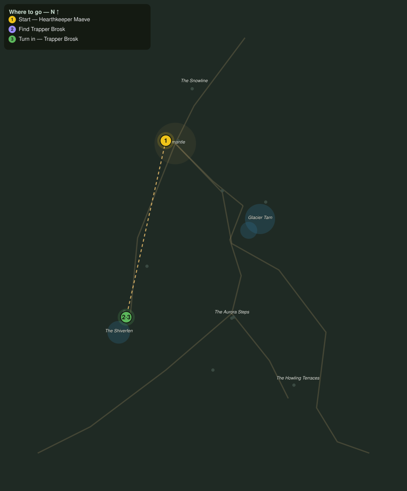

# The Silent Trapline

> Quest ID: `q_fv_silent_trapline` · The Frostveil Reach

| | |
|---|---|
| **Recommended level** | 17+ |
| **Quest giver** | **Hearthkeeper Maeve**, Keeper of the Hearth-Lodge _(at ~x:-40, z:1557)_ |
| **Turn in to** | **Trapper Brosk**, Shiverfen Trapper _(at ~x:-82, z:1744)_ |

## Story

> Old Brosk works the Shiverfen trapline west of here, and every week for eleven years he has sent a bundle of furs up with the wood sledge. Two weeks now, nothing. He is too stubborn to freeze and too careful to drown, <your name>, so something else is wrong. Find his camp at the fen and see him breathing.

## How to complete

- **Interact with **Trapper Brosk**, Shiverfen Trapper _(at ~x:-82, z:1744)_**
  - _Tracker: Find Trapper Brosk_

Then return to **Trapper Brosk**, Shiverfen Trapper _(at ~x:-82, z:1744)_ to turn in.

## Rewards

- **XP:** 2600
- **Money:** 1000 copper

## On completion

> Maeve sent you? Ha. Eleven years and the woman still thinks the fen will eat me. Well... this year she might be right. Look at what it's done to my lines.

## Leads to

- Sprites in the Traps (`q_fv_sprung_traps`)

## Where to go

**[🧭 Open this route in 3D →](#/questroute/q_fv_silent_trapline)**

_Numbered route: ① start → objectives → 3 turn in. Faint dots are the rest of the zone for context — see the [full zone map](README.md). Mob names above link to the [bestiary](bestiary.md)._
