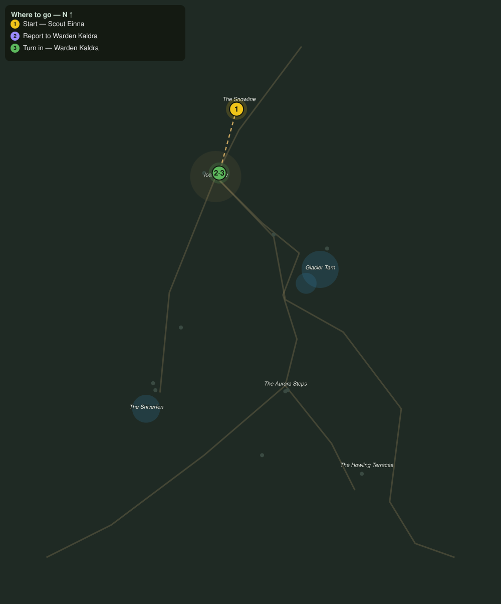

# Word from the Snowline

> Quest ID: `q_fv_snowline_report` · The Frostveil Reach

| | |
|---|---|
| **Recommended level** | 16+ |
| **Quest giver** | **Scout Einna**, Snowline Scout _(at ~x:-12, z:1502)_ |
| **Turn in to** | **Warden Kaldra**, Warden of Icemantle _(at ~x:-27, z:1557)_ |

## Story

> Every soul who climbs out of the Drakelands passes my fire, <your name>, and fewer climb every week. Warden Kaldra holds Icemantle up the north road. Tell her the pass is still open, and tell her a stranger walked it alone.

## How to complete

- **Interact with **Warden Kaldra**, Warden of Icemantle _(at ~x:-27, z:1557)_**
  - _Tracker: Report to Warden Kaldra_

Then return to **Warden Kaldra**, Warden of Icemantle _(at ~x:-27, z:1557)_ to turn in.

## Rewards

- **XP:** 2400
- **Money:** 900 copper

## On completion

> The pass holds, then. Einna sits that waycamp through storms that bury the road markers, and she has never once sent me idle news. Welcome to Icemantle, $N.

## Leads to

- Wolves at the Door (`q_fv_wolves_at_the_door`)
- Pelts for the Lodge (`q_fv_winter_pelts`)
- Embers on the Tarn Road (`q_fv_ember_caches`)

## Where to go

**[🧭 Open this route in 3D →](#/questroute/q_fv_snowline_report)**

_Numbered route: ① start → objectives → 3 turn in. Faint dots are the rest of the zone for context — see the [full zone map](README.md). Mob names above link to the [bestiary](bestiary.md)._
