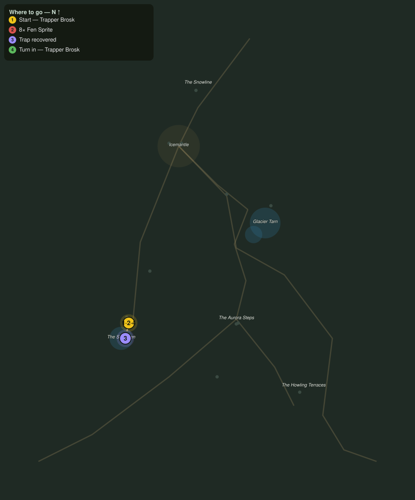

# Sprites in the Traps

> Quest ID: `q_fv_sprung_traps` · The Frostveil Reach

| | |
|---|---|
| **Recommended level** | 17+ (zone range 17–20) |
| **Quest giver** | **Trapper Brosk**, Shiverfen Trapper _(at ~x:-82, z:1744)_ |
| **Turn in to** | **Trapper Brosk**, Shiverfen Trapper _(at ~x:-82, z:1744)_ |
| **Requires** | The Silent Trapline (`q_fv_silent_trapline`) |

## Story

> Fen sprites, <your name>. The little devils spring my traps for sport and scatter the iron in the reeds. Drive them off, eight should teach the rest, and gather up what is left of my traplines while you are out there.

## How to complete

- **Kill 8× [Fen Sprite](bestiary.md#mob-fen_sprite)** (level 17–18)
  - Found in the open world at ~x:-84, z:1738 (3 mobs, radius 11)
  - _Tracker: Fen Sprite driven off_
- **Interact 4× with Sprung Fen Trap**
  - Locations: ~x:-92, z:1750 · ~x:-98, z:1764 · ~x:-80, z:1770 · ~x:-72, z:1756
  - _Tracker: Trap recovered_

Then return to **Trapper Brosk**, Shiverfen Trapper _(at ~x:-82, z:1744)_ to turn in.

## Rewards

- **XP:** 4800
- **Money:** 2600 copper

## On completion

> Four good traps back and the reeds gone quiet. You trap with a heavier hand than I do, $N, but I cannot argue with the results.

## Leads to

- Seeing Wren Home (`q_fv_seeing_wren_home`)

## Where to go

**[🧭 Open this route in 3D →](#/questroute/q_fv_sprung_traps)**

_Numbered route: ① start → objectives → 4 turn in. Faint dots are the rest of the zone for context — see the [full zone map](README.md). Mob names above link to the [bestiary](bestiary.md)._
