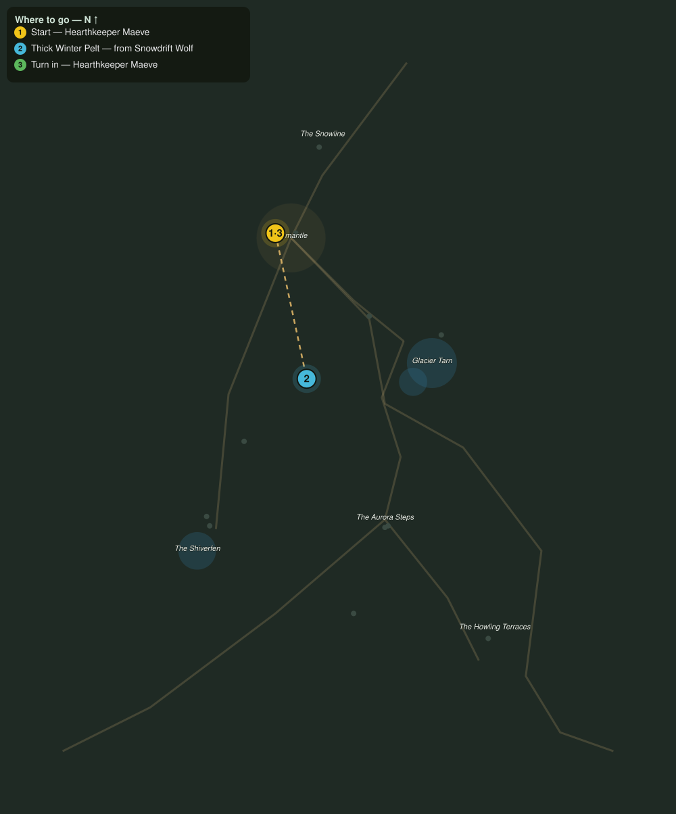

# Pelts for the Lodge

> Quest ID: `q_fv_winter_pelts` · The Frostveil Reach

| | |
|---|---|
| **Recommended level** | 17+ (zone range 17–20) |
| **Quest giver** | **Hearthkeeper Maeve**, Keeper of the Hearth-Lodge _(at ~x:-40, z:1557)_ |
| **Turn in to** | **Hearthkeeper Maeve**, Keeper of the Hearth-Lodge _(at ~x:-40, z:1557)_ |
| **Requires** | Word from the Snowline (`q_fv_snowline_report`) |

## Story

> Firewood keeps a body alive, <your name>, but wool will not turn this cold, only wolf-fur will. Six thick winter pelts off the snowdrift packs and I can line bedrolls for everyone the lodge shelters.

## How to complete

- **Collect 6× Thick Winter Pelt**
  - Drops from [**Snowdrift Wolf**](bestiary.md#mob-snowdrift_wolf) (60% chance) — Found in the open world at ~x:20, z:1610 (3 mobs, radius 10); Found in the open world at ~x:-60, z:1690 (3 mobs, radius 10)
  - _Tracker: Thick Winter Pelt_

Then return to **Hearthkeeper Maeve**, Keeper of the Hearth-Lodge _(at ~x:-40, z:1557)_ to turn in.

## Rewards

- **XP:** 4200
- **Money:** 2000 copper
- **Item reward (by class):**
  -  🟢 Hearth-Lined Treads — _warrior, mage, rogue_ · 58 armor, +4 Sta, +3 Spi

## On completion

> Fur like this is the only argument winter listens to. Take these treads, they are lined with the last batch.

## Where to go

**[🧭 Open this route in 3D →](#/questroute/q_fv_winter_pelts)**

_Numbered route: ① start → objectives → 3 turn in. Faint dots are the rest of the zone for context — see the [full zone map](README.md). Mob names above link to the [bestiary](bestiary.md)._
