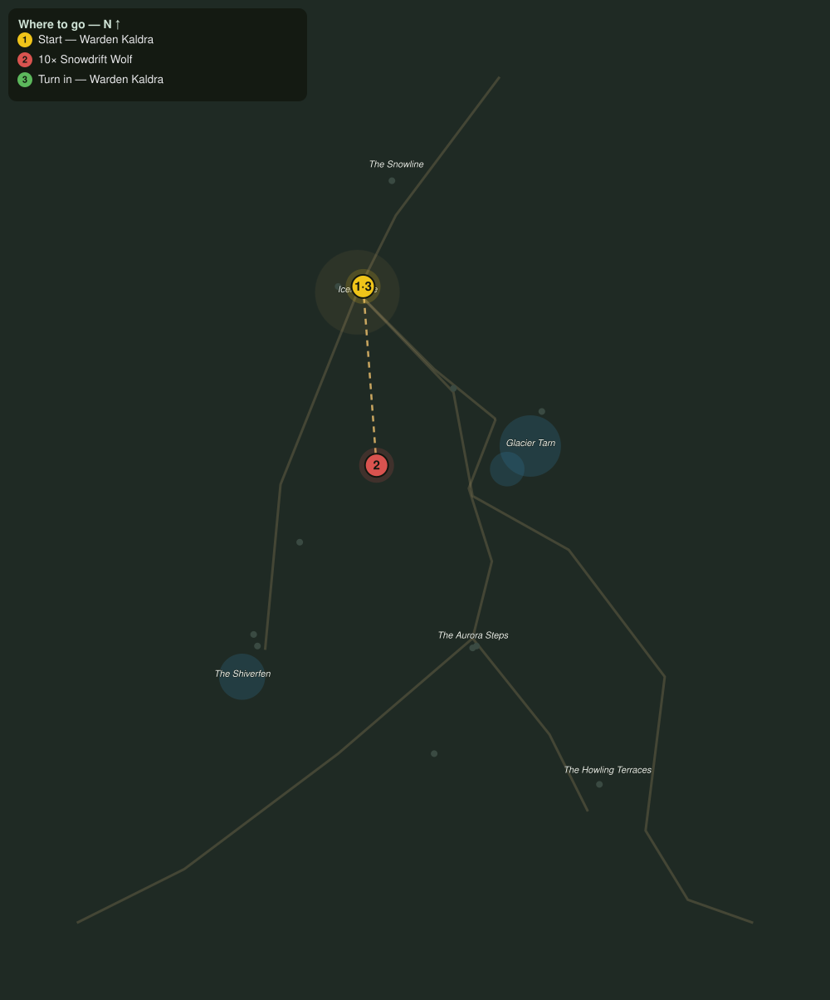

# Wolves at the Door

> Quest ID: `q_fv_wolves_at_the_door` · The Frostveil Reach

| | |
|---|---|
| **Recommended level** | 17+ (zone range 17–20) |
| **Quest giver** | **Warden Kaldra**, Warden of Icemantle _(at ~x:-27, z:1557)_ |
| **Turn in to** | **Warden Kaldra**, Warden of Icemantle _(at ~x:-27, z:1557)_ |
| **Requires** | Word from the Snowline (`q_fv_snowline_report`) |

## Story

> The snowdrift packs used to keep to the high benches. Now they cross the tarn road in daylight and my woodcutters will not leave the walls. Thin the packs, <your name>, ten of them, and the road is a road again.

## How to complete

- **Kill 10× [Snowdrift Wolf](bestiary.md#mob-snowdrift_wolf)** (level 17–18)
  - Found in the open world at ~x:20, z:1610 (3 mobs, radius 10)
  - Found in the open world at ~x:-60, z:1690 (3 mobs, radius 10)
  - _Tracker: Snowdrift Wolf slain_

Then return to **Warden Kaldra**, Warden of Icemantle _(at ~x:-27, z:1557)_ to turn in.

## Rewards

- **XP:** 4200
- **Money:** 2000 copper

## On completion

> Ten fewer shadows between here and the tarn. The woodcutters are already arguing over who goes out first.

## Leads to

- Lights over the Steps (`q_fv_lights_over_steps`)

## Where to go

**[🧭 Open this route in 3D →](#/questroute/q_fv_wolves_at_the_door)**

_Numbered route: ① start → objectives → 3 turn in. Faint dots are the rest of the zone for context — see the [full zone map](README.md). Mob names above link to the [bestiary](bestiary.md)._
