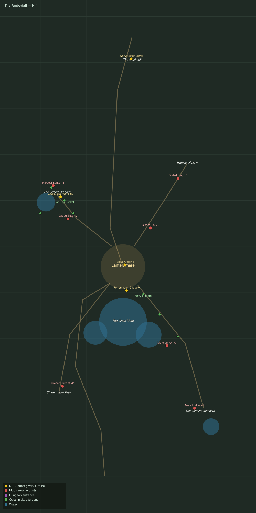

# The Amberfall

Level range: **18–20** · Hub: Lanternmere · 8 quests

_Gold = NPCs · red = mob camps (×count) · purple = dungeon entrances · green = ground pickups · blue = water._

📖 **[Bestiary for this zone](bestiary.md)** — every mob's health, armor, damage, and how to kill it.

| Lvl | Quest | Giver | Type |
|----:|-------|-------|------|
| 17 | [The Gold Road Down](q-af-goldmelt-road.md) | Waywatcher Sorrel | interact |
| 18 | [Foxes in the Lamplight](q-af-foxes-in-the-lamplight.md) | Reeve Ottoline | kill |
| 18 | [A Cart for the Orchard](q-af-orchard-call.md) | Reeve Ottoline | interact |
| 18 | [Sprites and Spigots](q-af-sprites-and-spigots.md) | Orchardist Pomeline | kill/interact |
| 18 | [Amber off the Herd](q-af-amber-from-the-herd.md) | Orchardist Pomeline | collect |
| 18 | [Lanterns on the Water](q-af-lanterns-on-the-water.md) | Ferrymaster Caddow | interact |
| 18 | [What Took the Moorings](q-af-what-took-the-moorings.md) | Ferrymaster Caddow | kill |
| 19 | [The Meredark](q-af-the-meredark.md) 👥 | Ferrymaster Caddow | kill |
