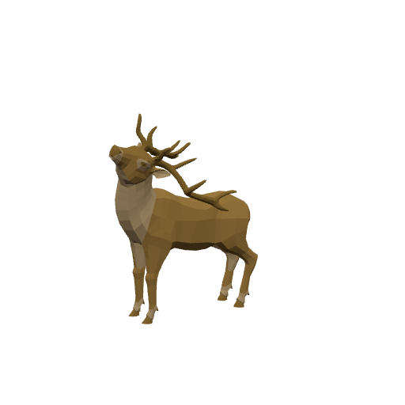
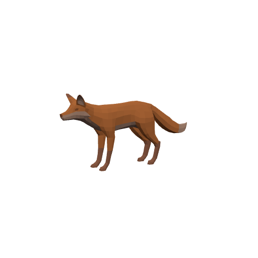
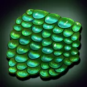
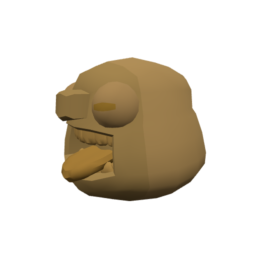
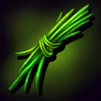

# Bestiary — The Amberfall

6 creatures you'll fight in this zone. Health/armor/damage are shown across the mob's spawn level range (mobs roll a random level within it). Mitigation % is what a same-level attacker's physical hits lose to armor — spells ignore armor.

> Threat tiers: **Boss** (dungeon, group it) · **Elite** (~2.3× HP, ~1.5× damage) · **Rare** (tough roamer) · normal (everything else).

## Common creatures

### Gilded Stag

| Stat | Value |
|---|---|
| Level | 18–19 |
| Family | Beast |
| Health | 360–378 HP |
| Armor (physical mitigation) | 204–216 (~10% vs a same-level attacker) |
| Melee damage | 38–62 per hit @ 2s swing (~24–26 DPS) |
| Location | The Amberfall · ~x:-300, z:1976 · ~x:-420, z:2020 — [🗺️ show on map](#/map/-300/1976) |

**Best way to kill:**

- Straightforward melee attacker — tank it, heal as needed, and burn it down. No special tricks.

**Loot:**

| Item | Type | Drop chance | Notes |
|---|---|---:|---|
|   Gilded Sap Clot | Quest item | 60% | quest item — only drops while on _Amber off the Herd_ |

### Gloam Fox

| Stat | Value |
|---|---|
| Level | 18 |
| Family | Beast |
| Health | 316 HP |
| Armor (physical mitigation) | 170 (~8% vs a same-level attacker) |
| Melee damage | 34–54 per hit @ 1.8s swing (~24 DPS) |
| Location | The Amberfall · ~x:-330, z:2030 — [🗺️ show on map](#/map/-330/2030) |

**Best way to kill:**

- Straightforward melee attacker — tank it, heal as needed, and burn it down. No special tricks.

**Loot:**

- Coins: 90 copper (always drops)

### Harvest Sprite

| Stat | Value |
|---|---|
| Level | 18–19 |
| Family | burrower |
| Health | 337–354 HP |
| Armor (physical mitigation) | 187–198 (~9% vs a same-level attacker) |
| Melee damage | 37–60 per hit @ 1.9s swing (~25–26 DPS) |
| Location | The Amberfall · ~x:-436, z:1984 — [🗺️ show on map](#/map/-436/1984) |

**Best way to kill:**

- Straightforward melee attacker — tank it, heal as needed, and burn it down. No special tricks.

**Loot:**

- Coins: 95 copper (always drops)

### Mere Lurker

| Stat | Value |
|---|---|
| Level | 19–20 |
| Family | mudfin |
| Health | 418–438 HP |
| Armor (physical mitigation) | 234–247 (~10–11% vs a same-level attacker) |
| Melee damage | 44–72 per hit @ 2s swing (~28–30 DPS) |
| Location | The Amberfall · ~x:-312, z:2158 · ~x:-282, z:2226 — [🗺️ show on map](#/map/-312/2158) |

**Best way to kill:**

- Straightforward melee attacker — tank it, heal as needed, and burn it down. No special tricks.

**Loot:**

- Coins: 100 copper (always drops)

| Item | Type | Drop chance | Notes |
|---|---|---:|---|
|  ⚫ Slimy Mudfin Scale | Junk | 40% | sells for 5c |

## Elites

### Orchard Treant — _Elite_

| Stat | Value |
|---|---|
| Level | 19–20 |
| Family | Ogre |
| Health | 1412–1477 HP |
| Armor (physical mitigation) | 288–304 (~13% vs a same-level attacker) |
| Melee damage | 73–119 per hit @ 2.6s swing (~36–38 DPS) |
| Respawn | ~25s |
| Location | The Amberfall · ~x:-426, z:2202 — [🗺️ show on map](#/map/-426/2202) |

**Best way to kill:**

- **Elite** — ~2.3× the health and ~1.5× the damage of a normal mob; bring a group or out-level it.
- Straightforward melee attacker — tank it, heal as needed, and burn it down. No special tricks.

**Loot:**

- Coins: 100 copper (always drops)

| Item | Type | Drop chance | Notes |
|---|---|---:|---|
|  ⚫ Tangled Weed | Junk | 40% | sells for 1c |

### The Meredark — _Elite_

| Stat | Value |
|---|---|
| Level | 20 |
| Family | mudfin |
| Health | 1587 HP |
| Armor (physical mitigation) | 304 (~13% vs a same-level attacker) |
| Melee damage | 82–128 per hit @ 2.4s swing (~44 DPS) |
| Respawn | ~25s |
| Location | The Amberfall |

**Best way to kill:**

- **Elite** — ~2.3× the health and ~1.5× the damage of a normal mob; bring a group or out-level it.
- Straightforward melee attacker — tank it, heal as needed, and burn it down. No special tricks.

**Loot:**

- Coins: 100 copper (always drops)

| Item | Type | Drop chance | Notes |
|---|---|---:|---|
|  ⚫ Slimy Mudfin Scale | Junk | 100% | sells for 5c |

---

[← Back to The Amberfall quests](README.md) · [Zone map](map.svg)
