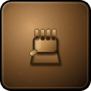
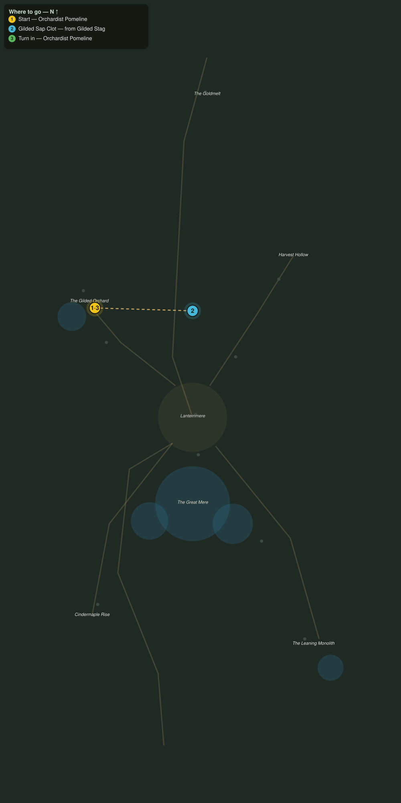

# Amber off the Herd

> Quest ID: `q_af_amber_from_the_herd` · The Amberfall

| | |
|---|---|
| **Recommended level** | 18+ (zone range 18–20) |
| **Quest giver** | **Orchardist Pomeline**, Keeper of the Gilded Rows _(at ~x:-428, z:1996)_ |
| **Turn in to** | **Orchardist Pomeline**, Keeper of the Gilded Rows _(at ~x:-428, z:1996)_ |
| **Requires** | A Cart for the Orchard (`q_af_orchard_call`) |

## Story

> The gilded stags bed down beneath my oldest trees, and the sap drips gold into their coats all night. Combed clots of it are the purest amber in the weald. Bring me six, <your name>. The stags will not thank you, but they will not miss it either.

## How to complete

- **Collect 6× Gilded Sap Clot**
  - Drops from [**Gilded Stag**](bestiary.md#mob-gilded_stag) (60% chance) — Found in the open world at ~x:-300, z:1976 (3 mobs, radius 12); Found in the open world at ~x:-420, z:2020 (2 mobs, radius 11)
  - _Tracker: Gilded Sap Clot_

Then return to **Orchardist Pomeline**, Keeper of the Gilded Rows _(at ~x:-428, z:1996)_ to turn in.

## Rewards

- **XP:** 4200
- **Money:** 2000 copper
- **Item reward (by class):**
  -  🟢 Sapbinder Grips — _warrior, mage, rogue_ · 54 armor, +4 Sta, +3 Int

## On completion

> Six clots, clean as poured honey. These gloves are stitched with the last batch, $N: sap-stiffened, and warmer than they look.

## Where to go

**[🧭 Open this route in 3D →](#/questroute/q_af_amber_from_the_herd)**

_Numbered route: ① start → objectives → 3 turn in. Faint dots are the rest of the zone for context — see the [full zone map](README.md). Mob names above link to the [bestiary](bestiary.md)._
