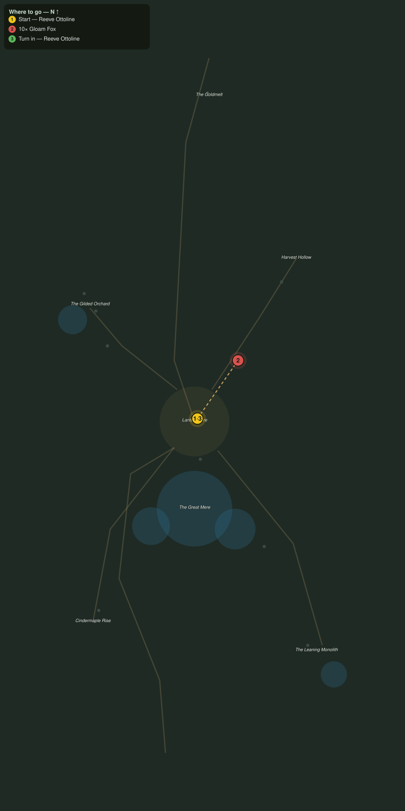

# Foxes in the Lamplight

> Quest ID: `q_af_foxes_in_the_lamplight` · The Amberfall

| | |
|---|---|
| **Recommended level** | 18+ (zone range 18–20) |
| **Quest giver** | **Reeve Ottoline**, Reeve of Lanternmere _(at ~x:-358, z:2070)_ |
| **Turn in to** | **Reeve Ottoline**, Reeve of Lanternmere _(at ~x:-358, z:2070)_ |
| **Requires** | The Gold Road Down (`q_af_goldmelt_road`) |

## Story

> The gloam foxes have learned what the lantern stores are worth, <your name>. Every dusk they slip the fences and carry off the tallow we press for the ferry lamps. Soft paws, softer conscience. Cull ten of them and the rest will remember to fear the town.

## How to complete

- **Kill 10× [Gloam Fox](bestiary.md#mob-gloam_fox)** (level 18–18)
  - Found in the open world at ~x:-330, z:2030 (2 mobs, radius 10)
  - _Tracker: Gloam Fox slain_

Then return to **Reeve Ottoline**, Reeve of Lanternmere _(at ~x:-358, z:2070)_ to turn in.

## Rewards

- **XP:** 4200
- **Money:** 2000 copper

## On completion

> Ten, and the stores went untouched last night for the first time this season. The lamplighters send their thanks, $N.

## Where to go

**[🧭 Open this route in 3D →](#/questroute/q_af_foxes_in_the_lamplight)**

_Numbered route: ① start → objectives → 3 turn in. Faint dots are the rest of the zone for context — see the [full zone map](README.md). Mob names above link to the [bestiary](bestiary.md)._
