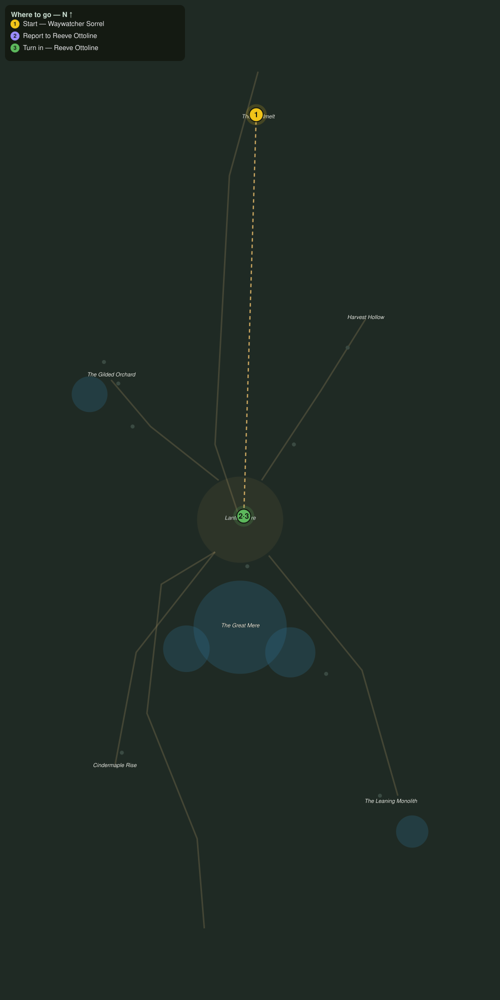

# The Gold Road Down

> Quest ID: `q_af_goldmelt_road` · The Amberfall

| | |
|---|---|
| **Recommended level** | 17+ |
| **Quest giver** | **Waywatcher Sorrel**, Watcher of the Goldmelt _(at ~x:-351, z:1846)_ |
| **Turn in to** | **Reeve Ottoline**, Reeve of Lanternmere _(at ~x:-358, z:2070)_ |

## Story

> You came over the Goldmelt, <your name>, snow still on your boots. I keep this shrine so Lanternmere knows who walks in from the cold, and lately I have had little to report. Take the gold road down to the town, find Reeve Ottoline by the well, and tell her the pass is quiet.

## How to complete

- **Interact with **Reeve Ottoline**, Reeve of Lanternmere _(at ~x:-358, z:2070)_**
  - _Tracker: Report to Reeve Ottoline_

Then return to **Reeve Ottoline**, Reeve of Lanternmere _(at ~x:-358, z:2070)_ to turn in.

## Rewards

- **XP:** 2400
- **Money:** 900 copper

## On completion

> Quiet on the Goldmelt, and a traveler with snow in their hair to prove it. Sorrel keeps her watch too well to send idle word. Be welcome in Lanternmere, $N. The lanterns burn for you.

## Leads to

- Foxes in the Lamplight (`q_af_foxes_in_the_lamplight`)
- A Cart for the Orchard (`q_af_orchard_call`)
- Lanterns on the Water (`q_af_lanterns_on_the_water`)

## Where to go

**[🧭 Open this route in 3D →](#/questroute/q_af_goldmelt_road)**

_Numbered route: ① start → objectives → 3 turn in. Faint dots are the rest of the zone for context — see the [full zone map](README.md). Mob names above link to the [bestiary](bestiary.md)._
