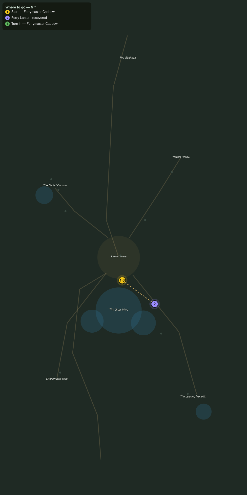

# Lanterns on the Water

> Quest ID: `q_af_lanterns_on_the_water` · The Amberfall

| | |
|---|---|
| **Recommended level** | 18+ (zone range 18–20) |
| **Quest giver** | **Ferrymaster Caddow**, Keeper of the Lantern Ferries _(at ~x:-356, z:2098)_ |
| **Turn in to** | **Ferrymaster Caddow**, Keeper of the Lantern Ferries _(at ~x:-356, z:2098)_ |
| **Requires** | The Gold Road Down (`q_af_goldmelt_road`) |

## Story

> Every ferry on the Mere carries a stern lantern, <your name>, and three of my boats came back at dawn without theirs. The fog took them, or something in the fog did. They wash up along the east shore when the wind turns. Walk the shore road and bring my lanterns home.

## How to complete

- **Interact 3× with Ferry Lantern**
  - Locations: ~x:-338, z:2102 · ~x:-320, z:2124 · ~x:-300, z:2148
  - _Tracker: Ferry Lantern recovered_

Then return to **Ferrymaster Caddow**, Keeper of the Lantern Ferries _(at ~x:-356, z:2098)_ to turn in.

## Rewards

- **XP:** 4200
- **Money:** 2000 copper

## On completion

> All three, and still burning. Ferry lanterns do not go out in water, $N. That is the point of them. What worries me is what pulled them loose.

## Leads to

- What Took the Moorings (`q_af_what_took_the_moorings`)

## Where to go

**[🧭 Open this route in 3D →](#/questroute/q_af_lanterns_on_the_water)**

_Numbered route: ① start → objectives → 3 turn in. Faint dots are the rest of the zone for context — see the [full zone map](README.md). Mob names above link to the [bestiary](bestiary.md)._
