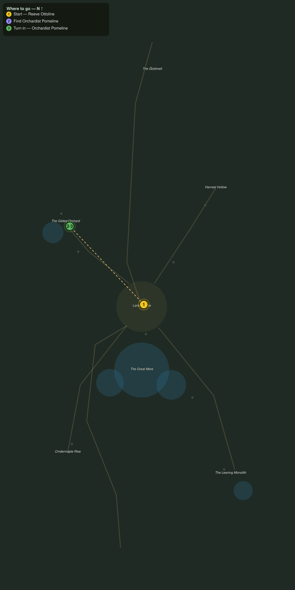

# A Cart for the Orchard

> Quest ID: `q_af_orchard_call` · The Amberfall

| | |
|---|---|
| **Recommended level** | 18+ |
| **Quest giver** | **Reeve Ottoline**, Reeve of Lanternmere _(at ~x:-358, z:2070)_ |
| **Turn in to** | **Orchardist Pomeline**, Keeper of the Gilded Rows _(at ~x:-428, z:1996)_ |
| **Requires** | The Gold Road Down (`q_af_goldmelt_road`) |

## Story

> Orchardist Pomeline keeps the Gilded Orchard on the west road, and her sap carts are three days overdue. The whole town runs on that amber sap, <your name>: lamp resin, sweetening, the harvest ale. Walk the west road and find out what keeps her.

## How to complete

- **Interact with **Orchardist Pomeline**, Keeper of the Gilded Rows _(at ~x:-428, z:1996)_**
  - _Tracker: Find Orchardist Pomeline_

Then return to **Orchardist Pomeline**, Keeper of the Gilded Rows _(at ~x:-428, z:1996)_ to turn in.

## Rewards

- **XP:** 2600
- **Money:** 1000 copper

## On completion

> The Reeve counts her carts, does she? Well, she can count them missing a while longer. Look at my rows, $N. I have greater troubles than a late delivery.

## Leads to

- Sprites and Spigots (`q_af_sprites_and_spigots`)
- Amber off the Herd (`q_af_amber_from_the_herd`)

## Where to go

**[🧭 Open this route in 3D →](#/questroute/q_af_orchard_call)**

_Numbered route: ① start → objectives → 3 turn in. Faint dots are the rest of the zone for context — see the [full zone map](README.md). Mob names above link to the [bestiary](bestiary.md)._
