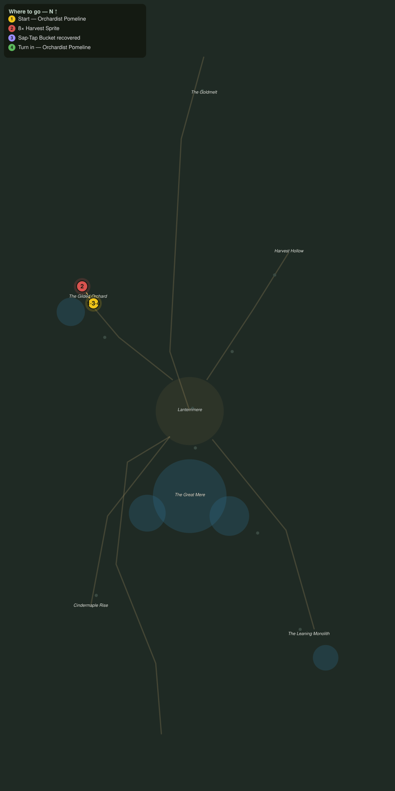

# Sprites and Spigots

> Quest ID: `q_af_sprites_and_spigots` · The Amberfall

| | |
|---|---|
| **Recommended level** | 18+ (zone range 18–20) |
| **Quest giver** | **Orchardist Pomeline**, Keeper of the Gilded Rows _(at ~x:-428, z:1996)_ |
| **Turn in to** | **Orchardist Pomeline**, Keeper of the Gilded Rows _(at ~x:-428, z:1996)_ |
| **Requires** | A Cart for the Orchard (`q_af_orchard_call`) |

## Story

> Harvest sprites, <your name>. They pry my sap-taps from the trunks for the sweetness inside and fling the buckets into the grass. Drive off eight of the little thieves and bring back four of my buckets, and the carts roll again.

## How to complete

- **Kill 8× [Harvest Sprite](bestiary.md#mob-harvest_sprite)** (level 18–19)
  - Found in the open world at ~x:-436, z:1984 (3 mobs, radius 10)
  - _Tracker: Harvest Sprite driven off_
- **Interact 4× with Sap-Tap Bucket**
  - Locations: ~x:-424, z:2000 · ~x:-438, z:1986 · ~x:-450, z:2014 · ~x:-414, z:2014
  - _Tracker: Sap-Tap Bucket recovered_

Then return to **Orchardist Pomeline**, Keeper of the Gilded Rows _(at ~x:-428, z:1996)_ to turn in.

## Rewards

- **XP:** 4800
- **Money:** 2600 copper

## On completion

> Four buckets back on their hooks and the rows gone quiet. You have a heavier hand with sprites than I do, $N, and today I am glad of it.

## Where to go

**[🧭 Open this route in 3D →](#/questroute/q_af_sprites_and_spigots)**

_Numbered route: ① start → objectives → 4 turn in. Faint dots are the rest of the zone for context — see the [full zone map](README.md). Mob names above link to the [bestiary](bestiary.md)._
