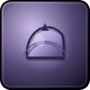
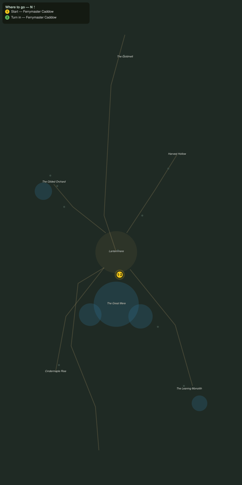

# The Meredark

> Quest ID: `q_af_the_meredark` · The Amberfall

| | |
|---|---|
| **Recommended level** | 19+ |
| **Quest giver** | **Ferrymaster Caddow**, Keeper of the Lantern Ferries _(at ~x:-356, z:2098)_ |
| **Turn in to** | **Ferrymaster Caddow**, Keeper of the Lantern Ferries _(at ~x:-356, z:2098)_ |
| **Requires** | What Took the Moorings (`q_af_what_took_the_moorings`) |
| **Group quest** | 👥 Suggested players: 2 |

## Story

> The old ferrymen have a name they only say ashore: the Meredark, the first lurker, old as the lake and twice as patient. It rose once before, the year the drowned jetty went under, and it is rising now. At dusk it suns itself on the jetty ruin off the south shore, <your name>. Take a friend, take two, and end it while it can still be ended.

## How to complete

- **Kill 1× [The Meredark](bestiary.md#mob-the_meredark)** (level 20–20, **Elite**)
  - Found in the open world at ~x:-358, z:2186 (1 mob, radius 6)
  - _Tracker: The Meredark slain_

Then return to **Ferrymaster Caddow**, Keeper of the Lantern Ferries _(at ~x:-356, z:2098)_ to turn in.

## Rewards

- **XP:** 6000
- **Money:** 3600 copper
- **Item reward (by class):**
  -  🔵 Mantle of the Meredark — _warrior, mage, rogue_ · 74 armor, +6 Sta, +4 Spi

## On completion

> The fog lifted off the Mere this morning, $N, and the whole town saw it. The ferries will run the night crossing again, and every lantern on the water will burn in your name. Take this: it was dredged from the drowned jetty, and no one has better right to wear it.

## Where to go

**[🧭 Open this route in 3D →](#/questroute/q_af_the_meredark)**

_Numbered route: ① start → objectives → 3 turn in. Faint dots are the rest of the zone for context — see the [full zone map](README.md). Mob names above link to the [bestiary](bestiary.md)._
