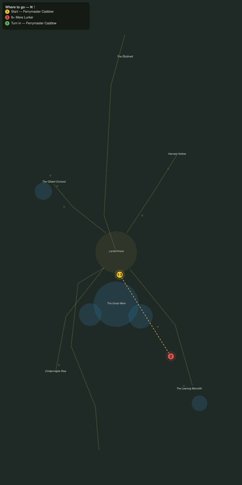

# What Took the Moorings

> Quest ID: `q_af_what_took_the_moorings` · The Amberfall

| | |
|---|---|
| **Recommended level** | 18+ |
| **Quest giver** | **Ferrymaster Caddow**, Keeper of the Lantern Ferries _(at ~x:-356, z:2098)_ |
| **Turn in to** | **Ferrymaster Caddow**, Keeper of the Lantern Ferries _(at ~x:-356, z:2098)_ |
| **Requires** | Lanterns on the Water (`q_af_lanterns_on_the_water`) |

## Story

> Now I will tell you what I did not say in front of the town. The moorings were not slipped, they were bitten through. Mere lurkers, bolder every night, dragging at the ropes and the rudders. Put eight of them back under the water for good, <your name>, before a ferryman goes with them.

## How to complete

- **Kill 8× [Mere Lurker](bestiary.md#mob-mere_lurker)** (level 19–20)
  - Found in the open world at ~x:-312, z:2158 (2 mobs, radius 8)
  - Found in the open world at ~x:-282, z:2226 (2 mobs, radius 8)
  - _Tracker: Mere Lurker slain_

Then return to **Ferrymaster Caddow**, Keeper of the Lantern Ferries _(at ~x:-356, z:2098)_ to turn in.

## Rewards

- **XP:** 4600
- **Money:** 2400 copper

## On completion

> Eight fewer shapes in the shallows, and the crossing ran on time today for the first time in a fortnight. But bold lurkers are driven lurkers, $N. Something beneath the Mere is moving them.

## Leads to

- The Meredark (`q_af_the_meredark`)

## Where to go

**[🧭 Open this route in 3D →](#/questroute/q_af_what_took_the_moorings)**

_Numbered route: ① start → objectives → 3 turn in. Faint dots are the rest of the zone for context — see the [full zone map](README.md). Mob names above link to the [bestiary](bestiary.md)._
