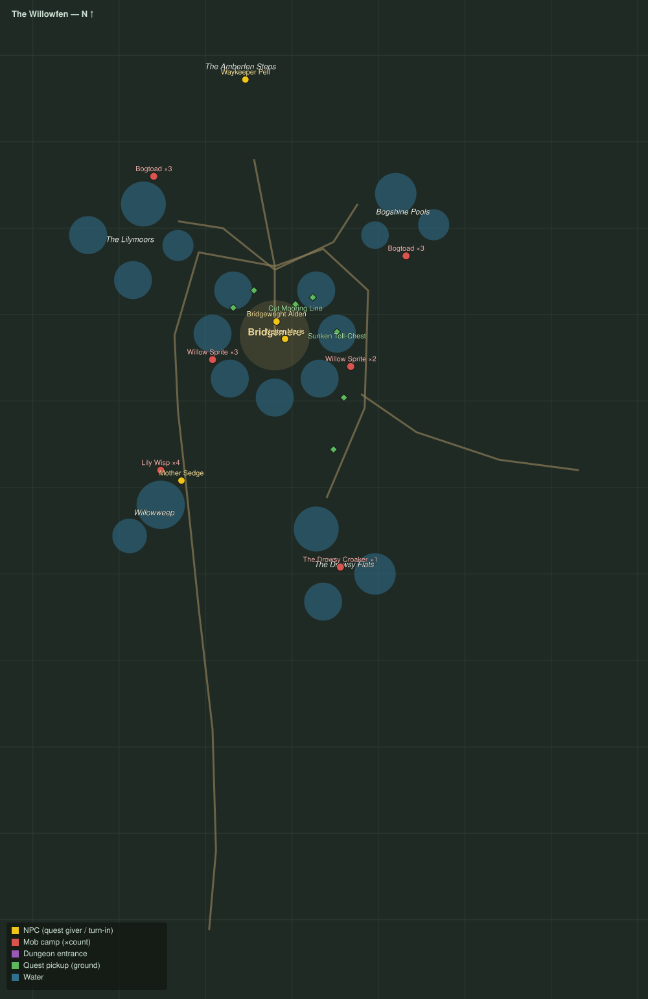

# The Willowfen

Level range: **19–20** · Hub: Bridgemere · 8 quests

_Gold = NPCs · red = mob camps (×count) · purple = dungeon entrances · green = ground pickups · blue = water._

📖 **[Bestiary for this zone](bestiary.md)** — every mob's health, armor, damage, and how to kill it.

| Lvl | Quest | Giver | Type |
|----:|-------|-------|------|
| 18 | [Across the Fenway](q-wf-across-the-fenway.md) | Waykeeper Pell | interact |
| 19 | [The Rope-Chewers](q-wf-rope-chewers.md) | Bridgewright Alden | kill |
| 19 | [Mind the Moorings](q-wf-mind-the-moorings.md) | Bridgewright Alden | interact |
| 19 | [Eels for the Smokehouse](q-wf-eels-for-the-smokehouse.md) | Netter Maris | collect |
| 19 | [Toll and Tangle](q-wf-toll-and-tangle.md) | Netter Maris | kill/interact |
| 19 | [The Witch of Willowweep](q-wf-witch-of-willowweep.md) | Bridgewright Alden | interact |
| 19 | [Wisplight Charms](q-wf-wisplight-charms.md) | Mother Sedge | collect |
| 20 | [The Croaker's Hush](q-wf-croakers-hush.md) 👥 | Mother Sedge | kill |
