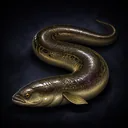
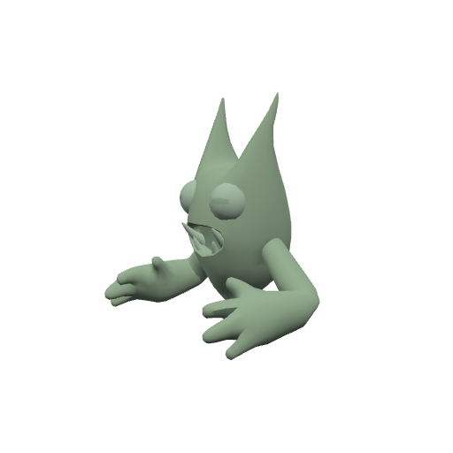

# Bestiary — The Willowfen

4 creatures you'll fight in this zone. Health/armor/damage are shown across the mob's spawn level range (mobs roll a random level within it). Mitigation % is what a same-level attacker's physical hits lose to armor — spells ignore armor.

> Threat tiers: **Boss** (dungeon, group it) · **Elite** (~2.3× HP, ~1.5× damage) · **Rare** (tough roamer) · normal (everything else).

## Common creatures

### Bogtoad

| Stat | Value |
|---|---|
| Level | 19–20 |
| Family | mudfin |
| Health | 416–436 HP |
| Armor (physical mitigation) | 216–228 (~10% vs a same-level attacker) |
| Melee damage | 42–68 per hit @ 2s swing (~27–28 DPS) |
| Location | The Willowfen · ~x:-430, z:270 · ~x:-284, z:316 — [🗺️ show on map](#/map/-430/270) |

**Best way to kill:**

- Straightforward melee attacker — tank it, heal as needed, and burn it down. No special tricks.

**Loot:**

- Coins: 100 copper (always drops)

| Item | Type | Drop chance | Notes |
|---|---|---:|---|
|   Plump Fen Eel | Quest item | 60% | quest item — only drops while on _Eels for the Smokehouse_ |

### Lily Wisp

| Stat | Value |
|---|---|
| Level | 19 |
| Family | Elemental |
| Health | 332 HP |
| Armor (physical mitigation) | 180 (~8% vs a same-level attacker) |
| Melee damage | 35–55 per hit @ 2s swing (~23 DPS) |
| Location | The Willowfen · ~x:-426, z:440 — [🗺️ show on map](#/map/-426/440) |

**Best way to kill:**

- Straightforward melee attacker — tank it, heal as needed, and burn it down. No special tricks.

**Loot:**

- Coins: 95 copper (always drops)

| Item | Type | Drop chance | Notes |
|---|---|---:|---|
|   Wisplight Globe | Quest item | 65% | quest item — only drops while on _Wisplight Charms_ |

### Willow Sprite

| Stat | Value |
|---|---|
| Level | 19–20 |
| Family | burrower |
| Health | 374–392 HP |
| Armor (physical mitigation) | 198–209 (~9% vs a same-level attacker) |
| Melee damage | 40–65 per hit @ 1.9s swing (~27–28 DPS) |
| Location | The Willowfen · ~x:-396, z:376 · ~x:-316, z:380 — [🗺️ show on map](#/map/-396/376) |

**Best way to kill:**

- Straightforward melee attacker — tank it, heal as needed, and burn it down. No special tricks.

**Loot:**

- Coins: 100 copper (always drops)

## Elites

### The Drowsy Croaker — _Elite_

| Stat | Value |
|---|---|
| Level | 20 |
| Family | mudfin |
| Health | 1808 HP |
| Armor (physical mitigation) | 323 (~13% vs a same-level attacker) |
| Melee damage | 88–137 per hit @ 2.4s swing (~47 DPS) |
| Respawn | ~25s |
| Location | The Willowfen · ~x:-322, z:496 — [🗺️ show on map](#/map/-322/496) |

**Best way to kill:**

- **Elite** — ~2.3× the health and ~1.5× the damage of a normal mob; bring a group or out-level it.
- Straightforward melee attacker — tank it, heal as needed, and burn it down. No special tricks.

**Loot:**

- Coins: 100 copper (always drops)

---

[← Back to The Willowfen quests](README.md) · [Zone map](map.svg)
