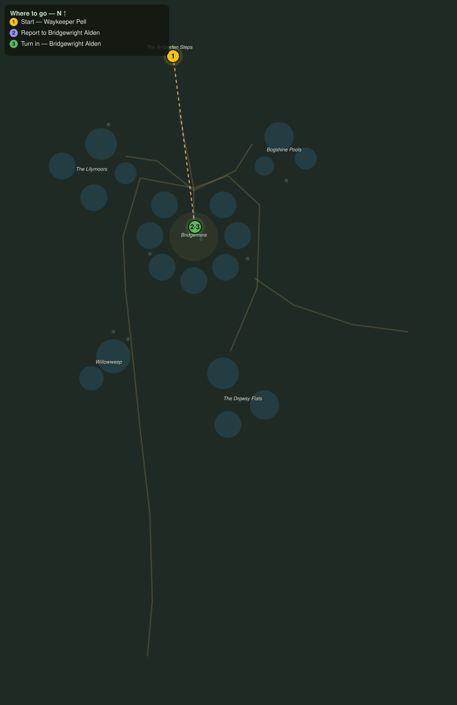

# Across the Fenway

> Quest ID: `q_wf_across_the_fenway` · The Willowfen

| | |
|---|---|
| **Recommended level** | 18+ |
| **Quest giver** | **Waykeeper Pell**, Keeper of the Amberfen Steps _(at ~x:-377, z:214)_ |
| **Turn in to** | **Bridgewright Alden**, Master of the Fenway _(at ~x:-359, z:354)_ |

## Story

> A gentle country, the Willowfen, but gentle is not the same as safe, <your name>. Follow the road north to the Fenway causeway and cross into Bridgemere. Tell Bridgewright Alden the Steps are open and the waycamp fire is lit.

## How to complete

- **Interact with **Bridgewright Alden**, Master of the Fenway _(at ~x:-359, z:354)_**
  - _Tracker: Report to Bridgewright Alden_

Then return to **Bridgewright Alden**, Master of the Fenway _(at ~x:-359, z:354)_ to turn in.

## Rewards

- **XP:** 2600
- **Money:** 950 copper

## On completion

> Pell keeps that fire burning through every fog the fen can breathe at her. If she says the Steps are open, they are open. Welcome to Bridgemere, $N. Watch your step on my planks and we will get along fine.

## Leads to

- The Rope-Chewers (`q_wf_rope_chewers`)
- Mind the Moorings (`q_wf_mind_the_moorings`)
- Eels for the Smokehouse (`q_wf_eels_for_the_smokehouse`)

## Where to go

**[🧭 Open this route in 3D →](#/questroute/q_wf_across_the_fenway)**

_Numbered route: ① start → objectives → 3 turn in. Faint dots are the rest of the zone for context — see the [full zone map](README.md). Mob names above link to the [bestiary](bestiary.md)._
