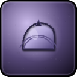
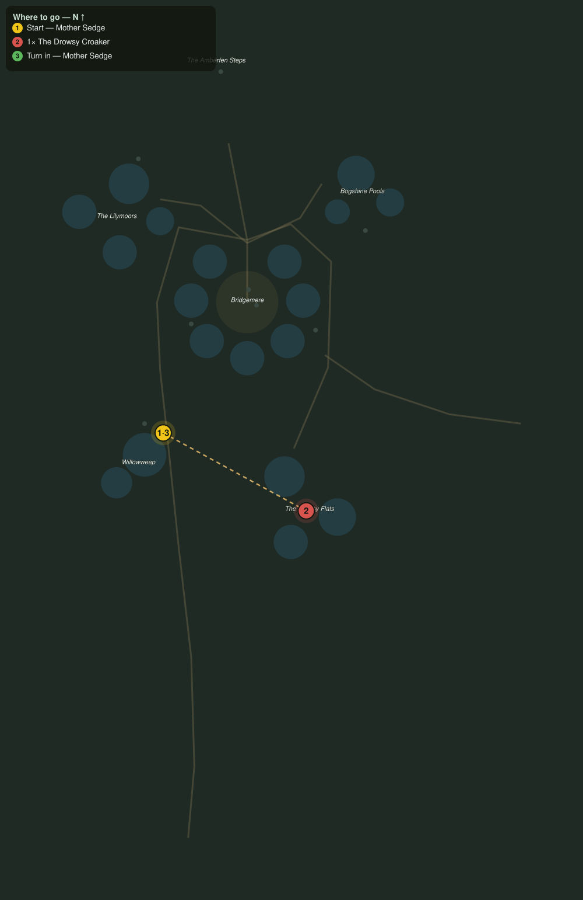

# The Croaker's Hush

> Quest ID: `q_wf_croakers_hush` · The Willowfen

| | |
|---|---|
| **Recommended level** | 20+ |
| **Quest giver** | **Mother Sedge**, Fen-Witch of Willowweep _(at ~x:-414, z:446)_ |
| **Turn in to** | **Mother Sedge**, Fen-Witch of Willowweep _(at ~x:-414, z:446)_ |
| **Requires** | Wisplight Charms (`q_wf_wisplight_charms`) |
| **Group quest** | 👥 Suggested players: 2 |

## Story

> Now you know the snorer's name, <your name>: the Drowsy Croaker, the old toad-king out on the Drowsy Flats. Every year his croak grows heavier, and every year more of the fen forgets to wake. The charms will keep your eyes open, but his bulk is another matter: bring a friend, and do not fight him in the water. Put the old king to a quieter sleep.

## How to complete

- **Kill 1× [The Drowsy Croaker](bestiary.md#mob-drowsy_croaker)** (level 20–20, **Elite**)
  - Found in the open world at ~x:-322, z:496 (1 mob, radius 5)
  - _Tracker: The Drowsy Croaker slain_

Then return to **Mother Sedge**, Fen-Witch of Willowweep _(at ~x:-414, z:446)_ to turn in.

## Rewards

- **XP:** 6200
- **Money:** 3800 copper
- **Item reward (by class):**
  -  🔵 Mantle of the Lily-Bed — _warrior, mage, rogue_ · 76 armor, +6 Sta, +4 Spi

## On completion

> Listen, $N. Nothing. The first true silence over this fen in thirty years, and half the town will not sleep tonight for the strangeness of it. The willows say thank you, in their way. Wear this, woven from his own lily-bed, and the fen will know you for a friend wherever the water reaches.

## Where to go

**[🧭 Open this route in 3D →](#/questroute/q_wf_croakers_hush)**

_Numbered route: ① start → objectives → 3 turn in. Faint dots are the rest of the zone for context — see the [full zone map](README.md). Mob names above link to the [bestiary](bestiary.md)._
