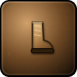
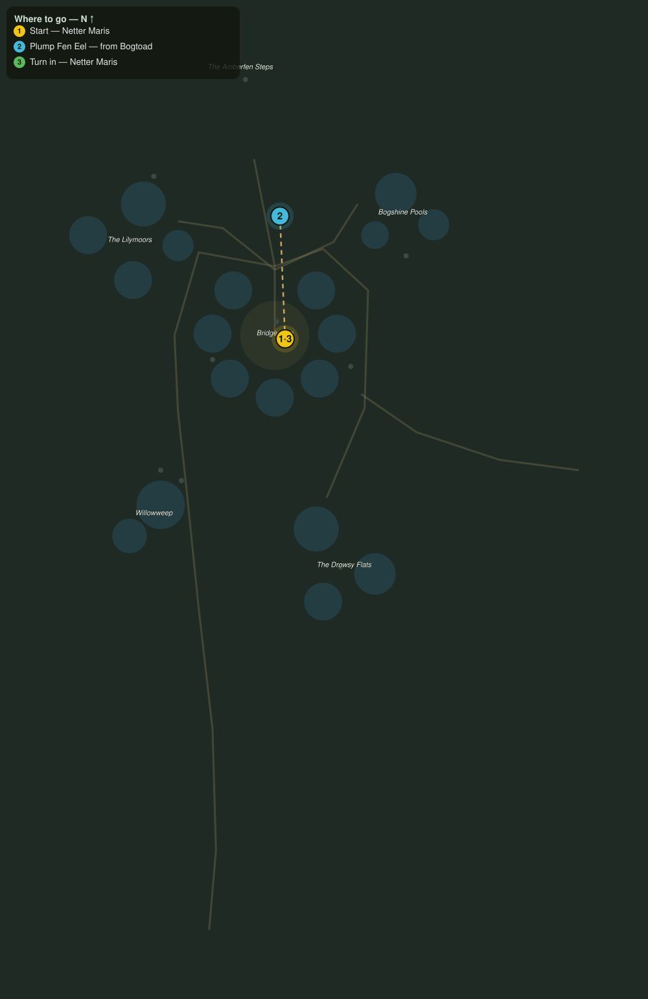

# Eels for the Smokehouse

> Quest ID: `q_wf_eels_for_the_smokehouse` · The Willowfen

| | |
|---|---|
| **Recommended level** | 19+ (zone range 19–20) |
| **Quest giver** | **Netter Maris**, Eel-Netter of Bridgemere _(at ~x:-354, z:364)_ |
| **Turn in to** | **Netter Maris**, Eel-Netter of Bridgemere _(at ~x:-354, z:364)_ |
| **Requires** | Across the Fenway (`q_wf_across_the_fenway`) |

## Story

> The bogtoads are not just eating my ropes, <your name>, they are eating my catch: they gulp the eels down whole, straight out of the traps. Cut six plump ones free of the greedy things before the meat spoils, and the smokehouse fires stay lit.

## How to complete

- **Collect 6× Plump Fen Eel**
  - Drops from [**Bogtoad**](bestiary.md#mob-bogtoad) (60% chance) — Found in the open world at ~x:-430, z:270 (3 mobs, radius 10); Found in the open world at ~x:-284, z:316 (3 mobs, radius 10); Found in the open world at ~x:-334, z:436 (3 mobs, radius 10); Found in the open world at ~x:-406, z:288 (3 mobs, radius 10)
  - _Tracker: Plump Fen Eel_

Then return to **Netter Maris**, Eel-Netter of Bridgemere _(at ~x:-354, z:364)_ to turn in.

## Rewards

- **XP:** 4400
- **Money:** 2200 copper
- **Item reward (by class):**
  -  🟢 Eelskin Mudwaders — _warrior, mage, rogue_ · 60 armor, +3 Sta, +2 Spi

## On completion

> Six good eels, barely bruised. The smokehouse will smell like money by morning. Here, these waders were mine when I was quicker: eelskin turns the wet like nothing else.

## Leads to

- Toll and Tangle (`q_wf_toll_and_tangle`)

## Where to go

**[🧭 Open this route in 3D →](#/questroute/q_wf_eels_for_the_smokehouse)**

_Numbered route: ① start → objectives → 3 turn in. Faint dots are the rest of the zone for context — see the [full zone map](README.md). Mob names above link to the [bestiary](bestiary.md)._
