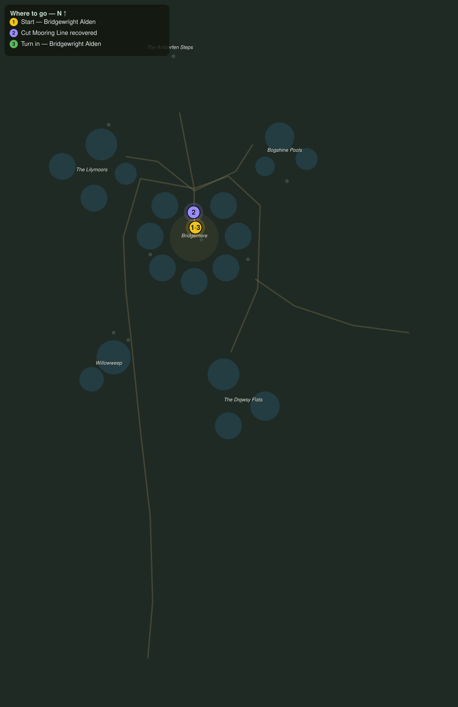

# Mind the Moorings

> Quest ID: `q_wf_mind_the_moorings` · The Willowfen

| | |
|---|---|
| **Recommended level** | 19+ (zone range 19–20) |
| **Quest giver** | **Bridgewright Alden**, Master of the Fenway _(at ~x:-359, z:354)_ |
| **Turn in to** | **Bridgewright Alden**, Master of the Fenway _(at ~x:-359, z:354)_ |
| **Requires** | Across the Fenway (`q_wf_across_the_fenway`) |

## Story

> Good rope is dear out here, <your name>: every line the toads bite through is a week of eel-money gone. The cut ends are still lying along the moat shore where the boats slipped them. Walk the boardwalks and bring me back four lines, and I can splice them good as new.

## How to complete

- **Interact 4× with Cut Mooring Line**
  - Locations: ~x:-348, z:344 · ~x:-338, z:340 · ~x:-372, z:336 · ~x:-384, z:346
  - _Tracker: Cut Mooring Line recovered_

Then return to **Bridgewright Alden**, Master of the Fenway _(at ~x:-359, z:354)_ to turn in.

## Rewards

- **XP:** 4400
- **Money:** 2100 copper

## On completion

> Look at that: clean bites, every one, but there is rope enough left to splice. You have saved me a month of coin and the netters a month of grumbling, $N.

## Where to go

**[🧭 Open this route in 3D →](#/questroute/q_wf_mind_the_moorings)**

_Numbered route: ① start → objectives → 3 turn in. Faint dots are the rest of the zone for context — see the [full zone map](README.md). Mob names above link to the [bestiary](bestiary.md)._
