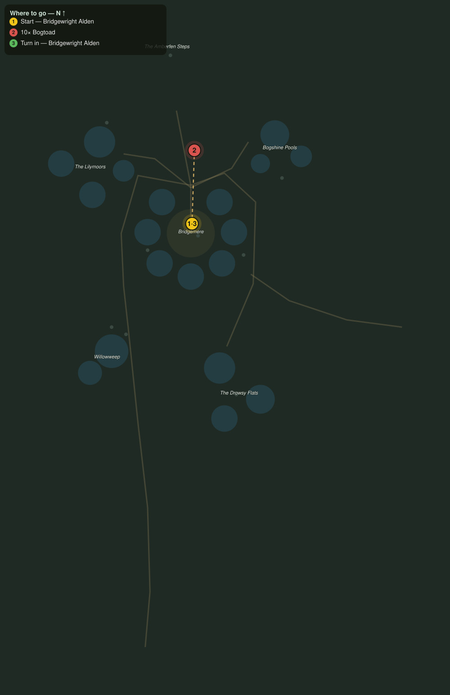

# The Rope-Chewers

> Quest ID: `q_wf_rope_chewers` · The Willowfen

| | |
|---|---|
| **Recommended level** | 19+ (zone range 19–20) |
| **Quest giver** | **Bridgewright Alden**, Master of the Fenway _(at ~x:-359, z:354)_ |
| **Turn in to** | **Bridgewright Alden**, Master of the Fenway _(at ~x:-359, z:354)_ |
| **Requires** | Across the Fenway (`q_wf_across_the_fenway`) |

## Story

> Bogtoads, <your name>. They haul up out of the moat at night and chew through my mooring ropes like they were reed stems. Three skiffs went drifting last week, and one of them had my good winch aboard. Thin them out, ten of the fat things, and the boats stay where we tie them.

## How to complete

- **Kill 10× [Bogtoad](bestiary.md#mob-bogtoad)** (level 19–20)
  - Found in the open world at ~x:-430, z:270 (3 mobs, radius 10)
  - Found in the open world at ~x:-284, z:316 (3 mobs, radius 10)
  - Found in the open world at ~x:-334, z:436 (3 mobs, radius 10)
  - Found in the open world at ~x:-406, z:288 (3 mobs, radius 10)
  - _Tracker: Bogtoad slain_

Then return to **Bridgewright Alden**, Master of the Fenway _(at ~x:-359, z:354)_ to turn in.

## Rewards

- **XP:** 4600
- **Money:** 2200 copper

## On completion

> Ten fewer sets of teeth in my moat. The skiffs sat their moorings all night for the first time in a month, $N. You have the thanks of every netter in town.

## Leads to

- The Witch of Willowweep (`q_wf_witch_of_willowweep`)

## Where to go

**[🧭 Open this route in 3D →](#/questroute/q_wf_rope_chewers)**

_Numbered route: ① start → objectives → 3 turn in. Faint dots are the rest of the zone for context — see the [full zone map](README.md). Mob names above link to the [bestiary](bestiary.md)._
